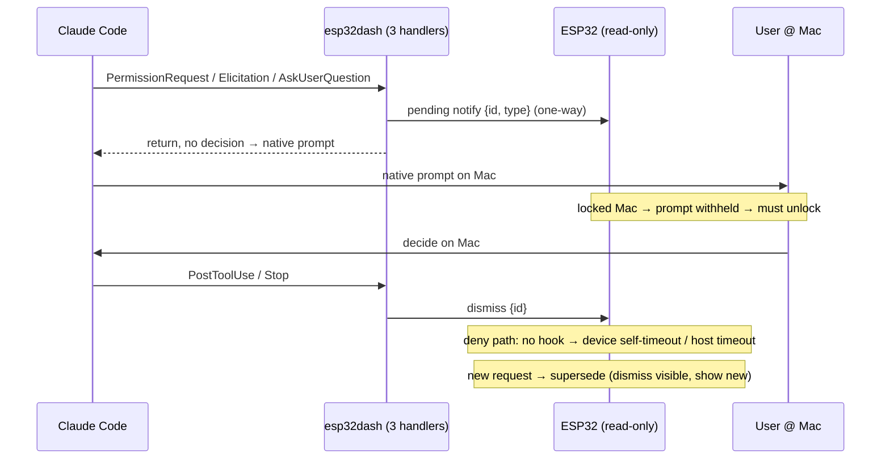

# refactor: Make the ESP32 a read-only status display for all Claude authorizations

## Summary

Remove the ESP32's ability to authorize Claude on every path, not just tool
permissions. All three device-decision handlers — `handle_permission_request`,
`handle_elicitation`, `handle_ask_user_question` — become non-blocking notifiers:
they push a "request pending" status to the device and let Claude Code's native
prompt decide. Both device→host authorization frames (`claude.approval.resolved`
and `claude.prompt.response`) are removed, so no device input can resolve any
request. All three waiting types drive a single read-only overlay showing the
interaction's type. `protocol.error` and the serial framing guard stay untouched.

This closes the lock-screen bypass on every path (a locked Mac withholds the native
prompt) and removes the standing complexity that existed only to support on-device
authorization.

---

## Problem Frame

The device can authorize Claude on three structurally identical paths, all feeding a
decision back through two device→host frames (`claude.approval.resolved` for
permissions, `claude.prompt.response` for Elicitation and AskUserQuestion). Only the
permission path is wired to the blocking hook today; Elicitation and AskUserQuestion
are latent — their handlers are live but the installed hook script does not route
them to the device. Latent is not safe: wiring either later reopens the bypass.

Two research facts (see origin and Sources) shape the approach:

- The host's `handle_permission_request` already falls through to Claude Code's
  native dialog when the agent is unreachable — the read-only design promotes that
  fall-through to the default for all three handlers.
- Claude Code gives a reliable **show** signal (the synchronous hook fires before the
  prompt) but **no reliable resolution signal** — on a deny, no tool runs, so no
  `PostToolUse`, no `Stop`, no dedicated event. Dismissal is ambient (later-activity
  hooks plus a timeout), per the brainstorm's chosen posture.

A prior plan covering only the permission path was reviewed and found to miss the
other two authorization paths, to drop the device's only overlay self-timeout with
the removed RPC, and to assume a supersede behavior neither end implements. This plan
covers all three paths and folds in those fixes.

---

## Key Technical Decisions

- **KTD1. All three handlers become non-blocking notifiers.** `handle_permission_request`,
  `handle_elicitation`, and `handle_ask_user_question` push a pending status and return,
  letting the native prompt decide. They keep a respond-style entry that still POSTs the
  pending request (so the device gets a request frame) but drop the poll-for-decision
  loop — a plain `ingest` reroute would skip the POST and the device would never show.
  (see origin: KD1, KD3)

- **KTD2. Remove both device→host authorization frames.** `claude.approval.resolved`
  and `claude.prompt.response` are deleted at both ends. This is the single mechanism
  that closes every bypass — with no inbound decision frame, no device input can
  resolve any request, including the latent Elicitation/AskUserQuestion paths. (see
  origin: KD2, R5, R8)

- **KTD3. One read-only overlay for all waiting types.** Permission, Elicitation, and
  AskUserQuestion all drive the same overlay. The prompt-request path (today
  sprite-emotion only) is wired to also drive the overlay; sprite emotion is retained
  as an additional layer. (see origin: KD4, KD7, R4)

- **KTD4. Dismissal is ambient, with a device-side self-timeout.** Show on request;
  dismiss on later activity (`PostToolUse`/`Stop`) plus a host timeout. Additionally
  keep a lightweight device-side overlay self-timeout so a wedged-but-connected host
  cannot leave the overlay stuck — the removed decision RPC was the device's only
  timeout today. (see origin: KD6)

- **KTD5. Real supersede.** A new request dismisses the currently-visible overlay
  before showing the new one. Today both ends block a second request while one is
  visible (host `claim_next_for_device` returns None; device `set_pending_approval`
  drops it), so overlapping requests would show a stale type — supersede must be
  implemented, not assumed.

- **KTD6. Show type, not content.** The overlay shows a coarse interaction type; no
  command, argument, or option content crosses to the device. (see origin: R2)

- **KTD7. Generation check leaves with the RPC; `protocol.error` stays.** The approval
  generation check serves only the removed decision RPC and goes with it.
  `protocol.error` is an unrelated serial line-overflow guard and is untouched.

- **KTD8. Host- and device-side frame removals land together.** Removing the inbound
  frame on one end while the other still sends it leaves a deploy window where a
  not-yet-flashed device could still return a decision. Sequence U2 and U4 as an
  atomic release.

---

## High-Level Technical Design

### Unified flow after the refactor

### Removable vs retained surface

| Component | Removed (decision-input path) | Retained / repurposed (one-way notify) |
|---|---|---|
| esp32dash | poll-for-decision loops in all three handlers; inbound `ApprovalResolved` + `PromptResponse` parse; `wait_for_decision`; `claude.approve` RPC; `chibi approve/approval` | respond-style entry that POSTs pending; the request/dismiss sends; `Dismissed`/`timed_out`; `/v1/claude/events`; PostToolUse/Stop dismiss path |
| device_link | outbound `claude.approval.resolved` + `claude.prompt.response`; `claude.approve` RPC + wait task + generation check; `resolve`/`cancel` API + `approval_decision_t` | `claude.approval.request`/`.dismiss` and `claude.prompt.request` inbound; `get_pending`; `dismiss`; `protocol.error` (untouched) |
| app_home | overlay buttons + touch callbacks; resolve call site; `btn_*` fields | overlay shell + type/desc labels; show/hide/visible; connection-changed handler (dismiss not deny); sprite emotion (retained) |

---

## Implementation Units

Four phases: host decision-path removal first (it owns the "where does the decision
come from" seam across all three handlers), then the firmware protocol, then the
unified read-only overlay, then type display and docs. esp32dash units carry Rust
tests (`cargo test --manifest-path tools/esp32dash/Cargo.toml`); firmware units (C)
have no test harness — verification is `make build` plus on-device smoke plus a
code-review invariant, mirroring `docs/plans/2026-06-13-001-fix-weather-refresh-state-ownership-plan.md`.

### Phase 1 — Host: stop deciding on-device (all three paths)

### U1. Make all three handlers non-blocking notifiers

- **Goal:** `handle_permission_request`, `handle_elicitation`, and
  `handle_ask_user_question` push a pending notification and return, letting the
  native prompt decide; none blocks waiting on the device.
- **Requirements:** R5, R6, R9 (origin).
- **Dependencies:** none.
- **Files:** `tools/esp32dash/src/hooks.rs` (hook routing for the three events),
  `tools/esp32dash/src/main.rs` (the three handlers), test module / `tools/esp32dash/tests/`.
- **Approach:** Keep a respond-style entry that still POSTs the pending request (so a
  request frame reaches the device) but remove the poll-for-decision loop in each
  handler; return so Claude Code's native prompt decides. Preserve the existing
  agent-unreachable fall-through as the now-default outcome. A plain `ingest` reroute
  is wrong — it skips the POST and the device never shows. The three handlers are NOT
  one edit: the permission handler POSTs to the approval store, which already emits
  `claude.approval.request` to the device; the Elicitation and AskUserQuestion handlers
  POST to the *prompt* store, which the host does not currently emit to the device at all
  (`send_device_prompt_request` has no live caller — see U8). U1 makes all three
  non-blocking; U8 adds the missing host-side prompt emit so the prompt paths actually
  reach the overlay.
- **Patterns to follow:** the existing agent-unreachable fall-through in
  `handle_permission_request`; the POST-then-notify path in `sync_device_approvals`.
- **Test scenarios:** (Rust)
  - Each of the three events produces a pending notification and returns without
    blocking on a device decision. Covers AE1, AE3.
  - No handler emits a decision on stdout. Covers AE5.
  - Agent-unreachable still falls through cleanly (no panic/hang).
  - The host path cannot return an approve/deny/accept for any of the three (a
    prerequisite for AE2; the lock-screen property itself is a Claude Code/Mac system
    behavior, enforced by the read-only device + no-host-decision, not unit-tested here).
- **Verification:** `cargo test` passes; no handler shells into a blocking wait; a real
  request of each type surfaces the Mac's native prompt while the device shows the overlay.

### U2. Remove the decision-input surface from the host

- **Goal:** Delete both inbound authorization frames and the decision machinery; keep
  the request/dismiss/timeout notification surface.
- **Requirements:** R5, R8 (origin).
- **Dependencies:** U1.
- **Files:** `tools/esp32dash/src/device.rs` (the `ApprovalResolved` and
  `PromptResponse` parse arms), `tools/esp32dash/src/approvals.rs` /
  `tools/esp32dash/src/prompts.rs` (`wait_for_decision`, decision resolution),
  `tools/esp32dash/src/agent.rs` (the device-event arms that resolve), `tools/esp32dash/src/main.rs`
  (`claude.approve` RPC, `chibi approve`/`approval`), plus affected Rust tests.
- **Approach:** Remove both inbound frame handlers (`claude.approval.resolved`,
  `claude.prompt.response`) end to end, the `wait_for_decision` paths, the
  `claude.approve` RPC, and the `chibi` decision subcommands. Keep dismiss/timeout
  handling and the request/dismiss sends. Leave decision fields in shared HTTP structs
  but stop populating them from the device.
- **Test scenarios:** (Rust)
  - A dismiss clears a pending request; a timeout marks it timed-out — both still work.
  - No parser/dispatch path accepts an inbound device decision (both frame arms gone);
    even if Elicitation/AskUserQuestion are wired to the device later, no decision can
    return. Covers AE6.
  - Removed `chibi approve` / `claude.approve` no longer resolve anything.
- **Verification:** `cargo test` passes; no reference to the removed frames or
  `wait_for_decision` remains.

### U3. Verify ambient dismiss and add supersede (host side)

- **Goal:** Confirm the existing activity-driven dismiss still fires after U1/U2, cover
  all waiting types, and dismiss a visible overlay when a new request arrives.
- **Requirements:** R3, R4 (origin).
- **Dependencies:** U1, U2.
- **Files:** `tools/esp32dash/src/agent.rs` (the existing `dismiss_matching` /
  `event_clears_pending_approval` path; the `claim_next_for_device` supersede change),
  relevant Rust tests.
- **Approach:** `PostToolUse` and `Stop` already route through `ingest` and drive
  `dismiss_matching` — the real work is verifying that still holds once the blocking
  respond route is gone, and confirming `Stop` matches on session for a Mac-side deny.
  Add supersede: on a new request, dismiss the currently-visible one (clear
  `device_visible`, send dismiss) before claiming the new one, rather than returning
  None and queuing it.
- **Patterns to follow:** the existing `dismiss_matching` machinery; the visible-approval
  timeout (`take_expired_visible_for_device`).
- **Test scenarios:** (Rust)
  - Approve: `PostToolUse` dismisses the pending overlay. Covers AE1.
  - Deny: no `PostToolUse`; `Stop` dismisses, else the timeout fires. Covers AE4.
  - Supersede: a second request dismisses the first visible overlay before showing the
    new one (no stale type displayed).
- **Verification:** `cargo test` passes; on-device, approving clears promptly, declining
  clears within the timeout, and overlapping requests never show a stale type.

### U8. Add the host-side prompt-request emit

- **Goal:** Make the host actually push `claude.prompt.request` to the device when a
  prompt (Elicitation / AskUserQuestion) is pending, so those two paths reach the overlay
  at all.
- **Requirements:** R4, R9 (origin).
- **Dependencies:** U1.
- **Files:** `tools/esp32dash/src/agent.rs` (the device-sync path that claims pending
  approvals; add a sibling for prompts), `tools/esp32dash/src/prompts.rs`, Rust tests.
- **Approach:** Today `send_device_prompt_request` has no live caller — the prompt store
  is read only to set `has_pending_prompt` for sprite emotion. Add a claim-and-send for
  prompts: when there is no approval backlog but a prompt backlog exists, claim the next
  prompt and send `claude.prompt.request` to the device. This is the missing half that
  makes the Elicitation/AskUserQuestion overlay possible at all — without it, U4/U6's
  device-side work is dead code. Settle the cross-store priority/supersede with the
  approval path (see U3, U5).
- **Patterns to follow:** the approval claim-and-send in `sync_device_approvals`
  (`claim_next_for_device` → `send_device_approval_request`) as the shape to mirror.
- **Test scenarios:** (Rust)
  - A pending prompt with no approval backlog produces a `claude.prompt.request` send to
    the device. Covers AE3.
  - A prompt and an approval pending together resolve by the defined cross-store priority
    (see U3), with no stale or double display.
- **Verification:** `cargo test` passes; on-device an Elicitation or AskUserQuestion
  surfaces the overlay, not only sprite emotion.

### Phase 2 — Firmware: device_link protocol

### U4. Remove both device decision frames and the approve RPC

- **Goal:** Delete the device's decision-return surface across both frames; keep
  one-way request/dismiss; drive the overlay from the prompt-request path too.
- **Requirements:** R5, R8, R10 (origin).
- **Dependencies:** pairs atomically with U2 (KTD8) for protocol symmetry; the
  prompt-request overlay needs U8 (host-side prompt emit) to fire at all.
- **Files:** `src/components/device_link/src/device_link.c`,
  `src/components/device_link/include/device_link/device_link.h`. No test file.
- **Approach:** Remove the outbound `claude.approval.resolved` and
  `claude.prompt.response` sends, the `claude.approve` RPC and its wait task / semaphore
  / generation check, and the `resolve`/`cancel` API + `approval_decision_t`. Delete the
  matching `capabilities[]` entries and `strcmp` branches. Keep the
  `claude.approval.request`/`.dismiss` and `claude.prompt.request` inbound handlers,
  `get_pending`, and `dismiss`; wire `claude.prompt.request` to publish an overlay event
  — either reuse `APP_EVENT_PERMISSION_REQUEST` or add a unified event (see Open
  Questions); it currently only drives sprite emotion. **Critical fix:** the internal
  `resolve_approval(DENY)` failure path (focus-home failure) becomes a dismiss/reset, not
  a decision. Leave `protocol.error` and the line-overflow guard untouched.
- **Patterns to follow:** the retained event-style request/dismiss handlers; the
  `capabilities[]` + `strcmp` dispatch convention; `publish_ui_event` for the overlay event.
- **Test scenarios:** No C harness; on-device smoke plus code-review invariant.
  - On-device: a request of any type shows the overlay; a dismiss hides it; no decision
    frame is ever sent. Covers AE3, AE5.
  - Failure path: force focus-home failure → resets/dismisses rather than denying.
  - Invariant (grep): no `claude.approval.resolved` / `claude.prompt.response` send, no
    `claude.approve` handler, no generation check remain; `protocol.error` and `get_pending`
    intact.
- **Verification:** `make build` exits 0; grep confirms the decision surface is gone and
  `protocol.error` untouched; on-device request/dismiss drives the overlay for all types.

### Phase 3 — Firmware: unified read-only overlay

### U5. Make the app_home overlay read-only and unified

- **Goal:** Remove the overlay's buttons/input; render it read-only for all waiting
  types; add device-side self-timeout and supersede.
- **Requirements:** R1, R2, R4 (origin).
- **Dependencies:** U4 (the `resolve`/`cancel` API it calls is removed there).
- **Files:** `src/apps/app_home/src/home_approval.c`,
  `src/apps/app_home/src/home_approval.h`, `src/apps/app_home/src/home_runtime.c`. No test file.
- **Approach:** Remove the button callbacks, the three buttons + flex row, and the
  resolve call site; drop `btn_*` fields. Keep the overlay shell, type/desc labels,
  show/hide/visible. Drive the overlay from the unified overlay event (permission +
  prompt). Change the connection-loss handler from cancel (deny) to dismiss. Add a
  device-side overlay self-timeout (a plain timer that hides + resets after N minutes,
  independent of the removed RPC) and accept a replacing request in `set_pending` so
  supersede works at the device end — the device has two pending slots (`s_approval_req`,
  `s_prompt_req`) with existing cross-guards (an approval evicts a pending prompt; a
  prompt is refused while an approval is pending), so define the cross-type supersede
  policy explicitly rather than inheriting that asymmetry. Mirror the read-only
  status-indicator pattern in `home_view.c`. Sprite emotion is retained alongside.
- **Patterns to follow:** the Claude status icon/dot in `src/apps/app_home/src/home_view.c`
  (rendered from model, no input); the `lv_timer` pattern in `home_runtime.c`
  (e.g. `unread_auto_clear_cb`). The overlay runs on the LVGL task — use `lv_timer`, not a
  FreeRTOS software timer (a FreeRTOS timer callback touching LVGL would break the
  LVGL→service lock order).
- **Test scenarios:** No C harness; on-device smoke plus review.
  - On-device: the overlay appears for permission and for a prompt-type request, shows
    the type, has no tappable controls, clears on dismiss. Covers AE1, AE3.
  - Touch on the overlay does nothing. Covers AE5.
  - Device self-timeout: with the host silent, the overlay clears itself after the timeout.
  - Supersede: a new request replaces the visible overlay's type rather than being dropped.
  - Connection loss clears the overlay without a deny.
- **Verification:** `make build` exits 0; on-device the overlay is display-only, unified
  across types, self-clears, and supersedes.

### Phase 4 — Display detail and docs

### U6. Show the interaction type on the overlay

- **Goal:** Carry a coarse type for each of the three interaction kinds to the device
  and render it; never send content.
- **Requirements:** R2 (origin).
- **Dependencies:** U1 (host notify), U4 (device handlers), U5 (overlay render).
- **Files:** `tools/esp32dash/src/main.rs` / `tools/esp32dash/src/agent.rs` (derive type,
  add to the request frame), `src/components/device_link/src/device_link.c` (read it into
  pending state), `src/apps/app_home/src/home_approval.c` (display), host-side Rust test.
- **Approach:** Map each interaction to a coarse type host-side ("Bash command", "File
  edit", "Question", …); add a `type` field to the request frame; store and render it.
  Keep all content off the wire (R2).
- **Test scenarios:**
  - (Rust) A Bash permission yields "Bash command"; an AskUserQuestion yields "Question";
    an unknown yields a safe generic label. Covers AE1, AE3.
  - (Rust) No command/argument/option string appears in the request frame. Covers R2.
  - (on-device) The overlay shows the type text for each kind.
- **Verification:** `cargo test` passes; `make build` exits 0; on-device the type renders
  and no content is shown.

### U7. Update CLAUDE.md

- **Goal:** Record the architectural change accurately.
- **Requirements:** R11 (origin).
- **Dependencies:** U1–U6.
- **Files:** `CLAUDE.md`.
- **Approach:** Update the `device_link` description: all Claude authorizations
  (permission, Elicitation, AskUserQuestion) are now one-way status notifications; the
  device returns no decision. Split the hardening note — the approval generation check
  is removed with the decision RPC (deliberate evolution), while `protocol.error`
  remains load-bearing and must not be reverted. Note the overlay is read-only and unified.
- **Test scenarios:** `Test expectation: none — documentation only.`
- **Verification:** the device_link section and constraint note match shipped behavior;
  no claim that the device decides remains.

---

## Scope Boundaries

In scope: removing device decision authority across all three authorization paths,
unifying the read-only overlay, and the host/protocol simplification. Out of scope:

- Selective downgrade (read-only only when locked) — single read-only mode (origin KD1).
- Showing full command/argument/option content on the device (origin R2).
- Removing sprite emotion — retained as an additional layer (origin KD7).
- `protocol.error` and the serial line-overflow guard — unrelated; stays.
- Headless / `--permission-mode=bypassPermissions`: no native prompt exists, so the
  lock-screen property does not apply; that configuration is out of scope (origin A1).

### Deferred to Follow-Up Work

- **Audit-branch coordination.** The audit branch's completed U10–U13 (approval-input
  reliability) patch a path this refactor removes; once this lands they are superseded —
  treat those commits as superseded rather than merging then deleting. The audit
  branch's non-approval work is independent.
- **Branch.** Independent of `fix/weather-refresh-state-ownership`; land on its own branch.
- **Weather-refresh race fix** — separate and unrelated.

---

## Risks & Dependencies

- **KTD1 hook semantics (load-bearing, verify first).** The design rests on "a handler
  returning empty stdout makes Claude Code show its native prompt." This is verified only
  for the agent-unreachable branch today (returns Ok with no println). Before building U1,
  confirm a clean register-then-return-empty produces the native prompt, not a default deny.
- **Deny-path overlay lingering (accepted).** No hook fires on deny; the overlay clears
  on the next `Stop`, the host timeout, or the device self-timeout. Accepted as ambient
  (KTD4); the device self-timeout bounds the worst case.
- **Protocol symmetry (U2/U4 atomic, KTD8).** Both ends must drop the decision frames
  together; `parse_device_event` returns None for unknown methods so a partial deploy
  errors on neither end, but a not-yet-flashed device could still return a decision in the
  gap — land them as one release.
- **Latent paths.** Elicitation/AskUserQuestion are not wired to the blocking hook today;
  removing their decision capability (U2/U4) closes them regardless of future wiring (R8).

---

## Open Questions (Deferred to Implementation)

- The overlay-dismiss timeout values (host and device-side self-timeout) and whether
  `Stop` is a good enough deny-path signal in practice.
- The coarse type → label mapping per interaction kind and the generic fallback.
- The residual shape of the one-way request/dismiss handlers after the decision frames
  are removed, and where unified pending state lives across permission/prompt types.
- Whether the prompt-request overlay event reuses `APP_EVENT_PERMISSION_REQUEST` or adds
  a unified event name.
