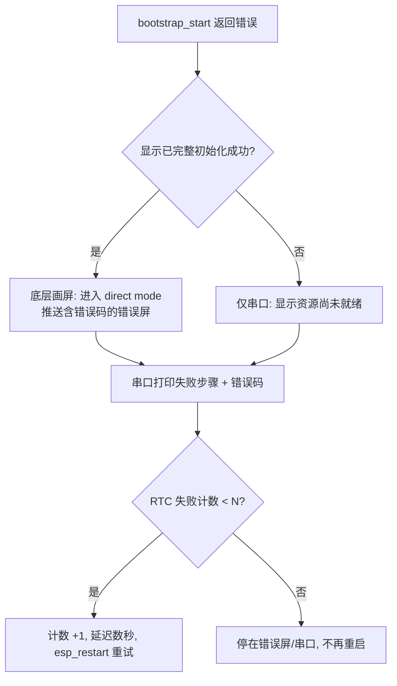

# refactor: ESP32 固件健壮性加固

## Summary

给固件五个已识别的脆弱点加上防御:把"只能在 LVGL 任务调用"的隐形约定变成会立刻炸的运行时断言、消除 `system_state` 持 `s_mutex` 时回调 `event_bus_publish` 的死锁可能、给唯一一处无限等待的 UI 锁加超时并降级、给 bootstrap 失败一个用户看得见的错误态加有界重试、把已在统计却本地不可见的丢事件计数暴露到串口。纯加固,不改任何现有功能行为。

---

## Problem Frame

这批改动来自对现状代码的审视,共同特征是"现在不一定崩,但脆弱":并发边界靠口头约定撑着、失败路径要么死等要么黑屏、可观测信号数了却看不到。它们都不是正在复现的 bug,而是把下一个改代码的人容易踩中的坑提前焊死。

弱点定位已核实(行号为审视时的近似锚点,实现时以实际代码为准):
- `app_manager_process_ui_events`(`src/components/core_app_manager/src/app_manager.c:568`)读 `s_foreground_app` 无锁,正确性依赖"只在 LVGL 任务执行"这个未写下来的约定。该函数当前只经 `bsp_display_set_ui_callback`(`src/main/bootstrap.c:114`)注册、只由 `lvgl_port_task` 调用——约定现在成立,但无任何检查防止未来从别处调用。
- `system_state` 的 `recompute_and_publish_if_needed`(`src/components/core_system_state/src/system_state.c:31`)在持 `s_mutex` 的临界区内调用 `event_bus_publish`。当前唯一会改 `system_state` 的订阅者 `power_runtime` 通过队列延迟写入(`src/components/power_runtime/src/power_runtime.c:134`),所以死锁不发生——但这又是一条靠"订阅者别在回调里直接调 setter"的口头约定撑着的边界。
- `app_manager_switch_to`(`src/components/core_app_manager/src/app_manager.c:461`)用 `bsp_board_lock(UINT32_MAX)` 无限等待 LVGL 锁。
- `app_main`(`src/main/main.c:11`)在 `bootstrap_start()` 失败后只打一行日志就 `for(;;) vTaskDelay`,设备黑屏;且 `CONFIG_ESP_TASK_WDT` 监控 idle task,空转里的 `vTaskDelay` 会喂狗,看门狗不会复位它。
- 丢事件计数 `ui_event_queue_drops`(`src/components/core_app_manager/src/app_manager.c:560`)有 getter、被 `device_link` 导出到 host JSON,但设备本地(串口/屏幕)看不到。

---

## Requirements

并发边界固化
- R1. `app_manager_process_ui_events` 在非 LVGL 任务被调用时,以运行时断言立即失败,而不是静默读到不一致的 `s_foreground_app`。这是防御未来回归的断言,不是修当前 bug——当前调用点唯一且正确。
- R2. `system_state` 不再在持 `s_mutex` 的临界区内调用 `event_bus_publish`;改为锁内取出待发事件、放锁后再 publish,使"订阅者回调反向调 setter"不再可能死锁。这是消除死锁可能,而非运行时检测它。

锁超时
- R3. `app_manager_switch_to` 获取 UI 锁使用有限超时;拿不到锁时返回已有的 `ESP_ERR_TIMEOUT` 并放弃本次切换,不阻塞调用任务。

启动失败的可见态
- R4. `bootstrap_start()` 在显示子系统完整初始化成功之后失败时,设备屏幕显示一个含错误码的错误屏,而不是黑屏。
- R5. `bootstrap_start()` 失败后设备不再静默空转:串口打印失败步骤与错误码;失败计数在前 N 次触发显式复位重试(瞬态故障自愈),达到上限后停在错误屏/串口不再重启(硬故障可读、不空耗)。

可观测性
- R6. UI 事件队列与 market 命令队列的丢弃计数在设备本地可见(非零时周期性打印到串口),不依赖外接 host 工具。

---

## Key Technical Decisions

- 断言加在"假设单任务"的函数上,不加在 `event_bus_publish` 上。`publish` 是无锁同步派发,被多个非 LVGL 任务合法调用(`device_link` reader、market/weather/settings/claude 后台任务、WiFi 事件回调、`esp_timer` tick、`system_state` 等),给它加"必须在 LVGL 任务"的断言会启动即崩。真正持有单任务假设的是 `app_manager_process_ui_events`。

- 死锁用消除而非检测来处理。审视一度设想给 `event_bus_publish` 加重入标志检测嵌套 publish,但这条路是错的:(1) `market_service_event_handler` 在 `APP_EVENT_POWER_CHANGED`/`NET_CHANGED` 时同步再 publish(`src/components/service_market/src/service_market.c:1070` 等),是一条每次电源/网络变化都会跑的**合法**嵌套 publish,重入 abort 会误崩;(2) 真正的死锁发生在订阅者二次 `xSemaphoreTake(s_mutex)` 处,根本到不了内层 publish,重入标志永远抓不到它。正解是把 `system_state` 的 publish 移出 `s_mutex` 临界区(锁内快照、放锁后 publish),从源头消除死锁可能,零运行时开销。

- LVGL 任务身份检查通过新增 `bsp_display_is_in_lvgl_task()` 暴露。`lvgl_port_task` 创建时(`src/components/bsp_board/src/bsp_display.c:514`)第 5 个参数传 `NULL`,未保存句柄;需改为保存 `TaskHandle_t` 并提供查询函数。这是 bsp 公共 API 的最小扩展,有唯一消费者(R1 断言)。

- 锁超时改动只影响 boot。`app_manager_switch_to`(持 `UINT32_MAX` 的那条路径)的唯一直接调用者是 `bootstrap.c:139`,跑在 boot 任务上,其 `ESP_RETURN_ON_ERROR` 已能传播 `ESP_ERR_TIMEOUT`。`device_link` 走的是队列变体 `app_manager_request_switch_to(..., UI_CONTROL_TIMEOUT_MS=2000)`(`src/components/device_link/src/device_link.c:416`),那 2000ms 是请求通知等待,与 `bsp_board_lock` 无关。把 461 行的 `UINT32_MAX` 换成有限值(2s 量级)即可,失败分支已存在。

- 错误屏的可画边界定为"显示完整初始化成功"(`s_initialized` 为真),不是 `init_panel()` 成功。底层画屏依赖的 `s_flush_done_semaphore`、`s_dma_buf` 都在 `init_lvgl()` 内创建(`bsp_display.c:472`、`483`),`bsp_display_begin_direct_mode()` 也 gate 在 `s_initialized` 上(`bsp_display.c:532` 才置真)——所以 `init_panel` 成功但 `init_lvgl` 失败的窄窗口画不出屏,只能走串口。为这个罕见窗口(多为 PSRAM 分配失败,彼时画屏本就不可靠)重构 bsp 的资源生命周期不值,故收窄边界、显式接受该窗口走串口(见 Open Questions)。

- bootstrap 失败兜底用显式复位 + 有界计数,不靠看门狗。看门狗监控 idle task,空转的 `vTaskDelay` 会喂狗使其永不触发。复位次数用 `RTC_NOINIT_ATTR` 计数器(重启保留、不磨损 flash),前 N 次 `esp_restart()` 重试,达上限后停住——避免硬故障下无限重启烧屏空耗。

- 丢包可观测性落点选串口周期日志,settings 诊断页留作后续。`device_link` 已把计数导出到 host JSON,程序化读取已覆盖;本地可见性用串口日志即可,仅在计数非零时打印避免刷屏。

---

## High-Level Technical Design

U3 的失败处理是这批改动里唯一有分支门的部分——画不画错误屏取决于显示子系统是否已完整初始化成功(`s_initialized`),以及失败计数是否到上限。

---

## Implementation Units

### U1. 给 process_ui_events 加 LVGL 任务身份断言

**Goal:** 把"`app_manager_process_ui_events` 只在 LVGL 任务执行"的隐形约定变成会立刻失败的运行时断言(R1)。

**Requirements:** R1

**Dependencies:** 无

**Files:**
- `src/components/bsp_board/src/bsp_display.c` — 保存 `lvgl_port_task` 句柄,新增 `bsp_display_is_in_lvgl_task()`
- `src/components/bsp_board/include/bsp_board/bsp_display.h`(或现有 bsp 公共头)— 声明新函数
- `src/components/core_app_manager/src/app_manager.c` — `app_manager_process_ui_events` 入口加任务断言

**Approach:** `lvgl_port_task` 创建处(bsp_display.c:514)把第 5 参数从 `NULL` 改为存入静态 `TaskHandle_t`;`bsp_display_is_in_lvgl_task()` 比较 `xTaskGetCurrentTaskHandle()`。`process_ui_events` 入口断言该函数返回真。断言风格沿用既有 `ESP_RETURN_ON_FALSE` + `ESP_LOGE`,或团队偏好的 `assert`/`abort`(致命约定违反)。这是预防性断言:当前调用点唯一且正确,断言保护的是未来有人从别处调用的回归。

**Patterns to follow:** `portMUX` 临界区与 `xTaskGetCurrentTaskHandle()` 用法见 `app_manager.c:144-153`、`300-352`。

**Test scenarios:**
- 任务断言命中:临时从一个后台任务(如 weather 任务)调用 `app_manager_process_ui_events`,确认断言触发并打印,而非静默返回。
- 正常路径不误报:正常运行(触摸切页、各 service 周期发事件)若干分钟,确认 LVGL 任务路径下断言从不触发,UI 行为不变。

**Verification:** 正常使用行为与改动前一致;从非 LVGL 任务注入调用时断言触发。

### U2. 给 UI 锁的无限等待加超时

**Goal:** 把 `app_manager_switch_to` 的 `bsp_board_lock(UINT32_MAX)` 换成有限超时,拿不到锁时放弃本次切换而非死等(R3)。

**Requirements:** R3

**Dependencies:** 无

**Files:**
- `src/components/core_app_manager/src/app_manager.c` — 第 461 行的锁调用 + 超时常量

**Approach:** `bsp_display_lock`/`bsp_board_lock` 已支持 `timeout_ms`(`UINT32_MAX` → `portMAX_DELAY`,见 `bsp_display.c:537`),把 461 行的 `UINT32_MAX` 换成有限值(2s 量级)。失败分支 `return ESP_ERR_TIMEOUT` 已存在。唯一受影响的直接调用者是 `bootstrap.c:139`(boot 任务),其 `ESP_RETURN_ON_ERROR` 会把超时传给 U3 的失败处理;`device_link` 用队列变体不受影响。全仓只有此一处对 UI 锁的无限等待(`lvgl_port_task` 自身已用 100ms)。

**Patterns to follow:** 有限超时取锁见 `bsp_display.c:385`(`bsp_display_lock(100)`)。

**Test scenarios:**
- 超时降级:临时在 `lvgl_port_task` 内 sleep 超过超时值占住锁,从 boot 路径触发 `app_manager_switch_to`,确认它超时后返回 `ESP_ERR_TIMEOUT` 而非永久阻塞。
- 正常切换不受影响:正常触摸切页,确认锁在超时内拿到、切换成功。

**Verification:** 正常切页无变化;锁被占用时按超时返回、不挂死。

### U3. bootstrap 失败的可见错误态与有界重试

**Goal:** 显示完整初始化成功后的失败画含错误码错误屏(R4);无论显示是否可用都打串口,失败计数前 N 次触发复位重试、达上限后停住(R5)。

**Requirements:** R4, R5

**Dependencies:** 无

**Files:**
- `src/main/main.c` — 失败分支:打印 → (条件)画错误屏 → RTC 计数判断 → 复位或停住
- `src/main/bootstrap.c` — 暴露"显示是否已完整初始化成功"的查询(若现有 API 未暴露)
- `src/components/bsp_board/src/bsp_display.c` — 复用 `bsp_display_begin_direct_mode()` + `bsp_display_push_native_rgb565()` 画错误屏

**Approach:** 见 High-Level Technical Design 的决策流。失败码复用 `bootstrap_start()` 返回的 `esp_err_t`。能否画屏取决于显示是否完整初始化(`s_initialized`)——需要一个从 bsp 查询该状态的方法(若未暴露则在 U3 内补最小查询)。错误屏用底层画屏(不依赖 LVGL):进 direct mode,推送预填 RGB565 缓冲(纯色背景 + 错误码,不必精致)。失败计数用 `RTC_NOINIT_ATTR` 变量跨重启保留:首次进入(`esp_reset_reason()` 非软复位)清零,每次失败 +1,小于 N 则延迟数秒后 `esp_restart()`,否则停在错误屏/串口。

**Execution note:** 先在显示已就绪的失败点验证错误屏能画出来,再处理显示未就绪与到达重试上限两条分支。

**Patterns to follow:** 底层画屏见 `bsp_display.c:228-291`(`panel_push_rows_blocking`)与 `583-603`;direct mode 进入见 `bsp_display.c:577`。

**Test scenarios:**
- 显示就绪后失败:临时让 `bsp_board_init()` 之后的某步(如某 service init)返回错误,确认屏幕出现含错误码的错误屏、串口打印对应步骤、计数未达上限时数秒后复位。
- 显示就绪前失败:临时让 `init_nvs()` 或 `init_lvgl()` 失败,确认走纯串口分支(不尝试画屏、不崩),打印后按计数复位。
- 复位与上限:对一个稳定必然失败的注入,确认前 N 次复位重试、第 N+1 次停在错误屏/串口不再重启(看启动日志次数验证),错误屏在停住时仍可见。

**Verification:** 两类失败点分别走画屏/纯串口分支;失败计数到上限前复位重试、之后停住,不黑屏空转也不无限重启。

### U4. 把丢事件计数暴露到串口

**Goal:** 把 UI 事件队列与 market 命令队列的丢弃计数周期性打印到串口,非零才打(R6)。

**Requirements:** R6

**Dependencies:** 无

**Files:**
- `src/main/bootstrap.c` — 在 `tick_1s_cb`(约 39-49 行)内按 N 秒节流,调 getter 并在计数非零时 `ESP_LOGI`

**Approach:** `app_manager_get_debug_stats()`(app_manager.c:526)与 `market_service_get_debug_stats()` 都已是线程安全的 copy-out getter。在已有的 1s tick 回调里用一个静态计数器做 N 秒(如 30s)节流,读两个 getter,任一 `*_queue_drops` 非零时打印计数与 `last_dropped_event`。不新建任务、不占屏幕。market 的命令队列丢弃(`service_market.c:555`)纳入同一行输出。

**Patterns to follow:** `tick_1s_cb` 现有结构见 `src/main/bootstrap.c:39-49`;getter 调用与 copy-out 见任意 service getter 用法。

**Test scenarios:**
- 非零才打:制造 UI 事件队列溢出(短时高频 publish 超过队列容量 16),确认串口在下一个节流窗口打印 drops 计数与最后丢弃事件名。
- 零不打:正常运行(无溢出),确认不打印任何 drops 行,无日志噪声。

**Verification:** 溢出时串口可见计数、无需 host 工具;无溢出时静默。

### U5. 把 system_state 的 publish 移出 s_mutex 临界区

**Goal:** 消除"`system_state` 持锁 publish → 订阅者回调反向调 setter → 二次持锁死锁"的可能(R2)。

**Requirements:** R2

**Dependencies:** 无

**Files:**
- `src/components/core_system_state/src/system_state.c` — `recompute_and_publish_if_needed` 及调用它的 setter
- 实现前需审查的同类点:其他在持自身 mutex 时调 `event_bus_publish` 的 service(若有)

**Approach:** 把 `recompute_and_publish_if_needed`(system_state.c:31 在 75 行拿的 `s_mutex` 临界区内)改成:锁内只计算"是否需要发、发什么事件",把结果存到栈变量;放锁后再 `event_bus_publish`。订阅者拿到通知后照常 query 最新状态(copy-out getter 自带锁),此时 `s_mutex` 已释放,即使订阅者回调内调 `system_state_set_*` 也不会死锁。这是标准的"不要跨回调持锁"模式,零运行时开销,且不依赖任何"订阅者别这么写"的口头约定。实现时审查 `system_state` 所有在锁内 publish 的路径,以及其他 service 是否有同样的持锁 publish,一并移出。

**Patterns to follow:** 锁内快照、锁外动作的写法见 `app_manager.c` 的 `switch_to_locked` 调用约定(锁内改状态、锁外/转发发事件)。

**Test scenarios:**
- 死锁路径不再死锁:临时写一个订阅者,在收到 `system_state` 发的事件回调里直接调 `system_state_set_*`,确认不死锁(改动前这会二次持锁挂死)。
- 行为不变:正常运行,确认电源/网络状态变化照常发出对应事件、订阅者读到的状态正确、事件顺序不影响最终一致性。
- 无锁内残留:审查确认 `system_state`(及发现的同类 service)再无持自身 mutex 时调 `event_bus_publish` 的路径。

**Verification:** 构造的反向 setter 回调不再死锁;状态事件分发行为与改动前一致。

---

## Scope Boundaries

### Deferred to Follow-Up Work
- settings 页诊断区块:在 `src/apps/app_settings/` 新建诊断页展示队列丢弃等计数。比串口日志更"产品化",但需新建页面且占用 640×172 屏幕预算,当前由串口日志 + host JSON 覆盖,价值增量不足。

### 明确不做(对话中已劝退)
- 给 `event_bus` 加重入检测标志:已证错(误崩 + 抓不到真死锁),被 U5 的"消除而非检测"取代。
- 给 service 加 generation counter / sequence 做"一致性快照":当前没有"多 service 数据必须同时刻采样"的需求,属投机性复杂度。
- 给 `event_bus` 换无锁队列库:16 长度队列 + 低频事件用不上。
- 重新引入 approval generation 校验:该路径随只读化(U1–U8 提交系列)已整条删除,不应回填。
- 硬件校准类(RTC 漂移补偿、亮度环境光自适应、电池放电曲线):性质不同且依赖未核实的板载传感器,单独讨论。

---

## Risks & Dependencies

- U3 错误屏覆盖面:`init_panel` 成功但 `init_lvgl` 失败的窄窗口画不出屏(底层画屏资源在 `init_lvgl` 内创建),只能走串口。已知并接受(见 Open Questions 的重构选项)。
- U3 重试上限取值:N 太小则瞬态故障(如开机时 Wi-Fi 未就绪)可能过早停住,太大则硬故障多空耗几轮。需按实际启动失败模式调,见 Open Questions。
- U5 行为等价性:把 publish 移出锁后,并发 set 时"状态更新顺序"与"事件发出顺序"可能不再严格一致;因订阅者总是 query 最新状态(copy-out),最终一致,但需 test scenario 确认无依赖发出顺序的订阅者。
- U1 依赖修改 `lvgl_port_task` 创建处保存句柄——bsp 内部改动,不影响现有调用方。
- U2 超时误降级:理论上 2s 内拿不到锁会放弃切换;实际唯一调用者是 boot,2s 远超正常持锁(`lvgl_port_task` 单轮上限 100ms),概率极低。

---

## Open Questions

- U3 是否值得为覆盖 `init_lvgl` 失败窗口而重构 bsp 资源生命周期:把 `s_flush_done_semaphore`、`s_dma_buf` 创建移到 `init_panel()` 末尾、direct mode 改 gate 在新的 `s_panel_ready` 上,即可在该窗口也画屏。默认不做(窗口罕见、内存压力下画屏本就不可靠),收窄到 `s_initialized`。若 `init_lvgl` 失败被观察到是常见失败模式,再考虑该重构。
- U3 重试上限 N 的取值:默认给一个小值(如 3),按实际启动失败分布调整;是否要指数退避亦留待观察。

---

## Sources / Research

- `event_bus_publish` 是无锁同步派发、被多任务合法调用:`src/components/core_event_bus/src/event_bus.c:48-63`;调用方含 `device_link.c:411`、`service_market.c:349`、`net_manager.c:73`、`system_state.c:31`、`bootstrap.c:48` 等。
- 合法嵌套 publish 路径(证伪重入检测方案):`market_service_event_handler`(`src/components/service_market/src/service_market.c:1174` 订阅)在 `APP_EVENT_POWER_CHANGED`/`NET_CHANGED` 时同步 `publish_market_event`(`service_market.c:1070`、`1078`)→ `event_bus_publish`(`service_market.c:349`)。
- system_state 持锁 publish 与 queue-defer:`system_state.c:75`(取 `s_mutex`)→ `:31`(锁内 publish);唯一会改 state 的订阅者 `power_runtime` 只 `xQueueSend`(`power_runtime.c:134`),在独立任务上调 setter(`power_runtime.c:69/77/81/100`)。
- 错误屏资源依赖:`bsp_display_begin_direct_mode()` gate 在 `s_initialized`;`s_flush_done_semaphore`(`bsp_display.c:472`)、`s_dma_buf`(`:483`)在 `init_lvgl()` 内创建,`s_initialized` 于 `:532`(init_panel + init_lvgl 均成功后)置真。底层画屏 `bsp_display.c:228-291`、`583-603`。
- UI 锁:唯一无限等待 `app_manager.c:461`(`UINT32_MAX`),唯一直接调用者 `bootstrap.c:139`;`device_link` 用队列变体 `app_manager_request_switch_to(..., UI_CONTROL_TIMEOUT_MS=2000)`(`device_link.c:416`、常量 `:44`);锁实现 `bsp_display.c:537`。
- 看门狗:`sdkconfig` 的 `CONFIG_ESP_TASK_WDT_*`(启用,5s,监控 idle task;`CONFIG_ESP_TASK_WDT_PANIC` 未设)。
- 丢包计数:结构 `src/components/core_app_manager/include/app_manager.h:60`,getter `app_manager.c:526`,累加 `:560`;market 对应 `service_market.c:555`;已被 `device_link` 导出到 host JSON。
