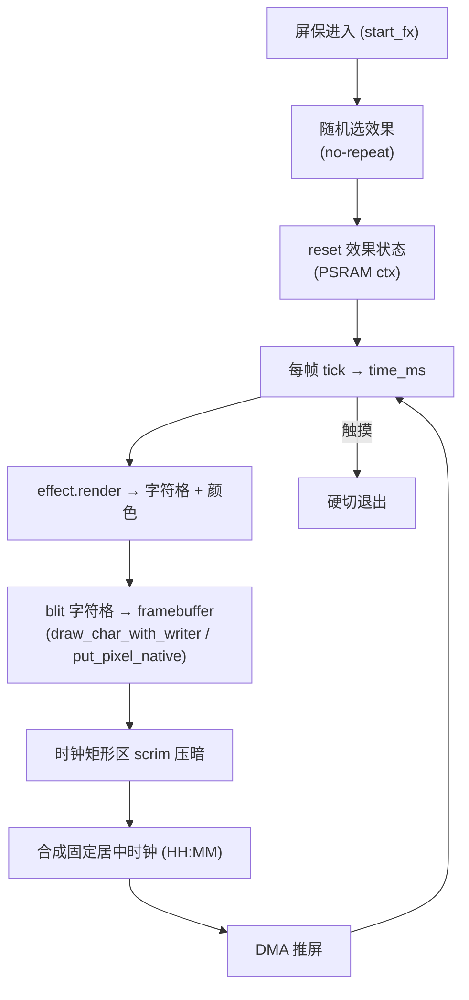

# feat: ASCII 屏保效果库

## Summary

把单一的渐变 shader 屏保换成一个 ASCII 字符效果库:8 个背景效果共用一个固定居中的时钟,每次进屏保随机抽一个运行到退出。效果按原生分辨率把字符直接 blit 进 framebuffer,复用现有 direct 推屏管线、字模 blitter 和生命周期;渐变 shader 退役。先落框架 + 5 个无状态效果,再落 3 个有状态效果,每个按 `compose_us` 门槛实测。

---

## Problem Frame

现状屏保是 `src/apps/app_home/src/screensaver_renderer.c` —— 一个逐像素定点 shader,渲染到 136×36 低分辨率 buffer 再放大到原生,只有一种渐变观感。它是当前最重的负载档位。需求(见 origin)要把它换成 omarchy 风格的多效果 ASCII 屏保。字符格子渲染比逐像素 shader 轻,推屏成本与内容无关,所以可行;真正要做的是搭一个效果库 + 选择机制,并把字模表补全。

---

## Requirements Trace

来自 origin 需求文档(`see origin`):

- R1 一组 ASCII 背景效果(8 个) → U4, U5
- R2 退役渐变 shader → U6
- R3 每个效果是自包含背景渲染器 → U2
- R4 共享合成的固定居中时钟 → U3
- R5 时钟 scrim 可读性 → U3
- R6 时钟 HH:MM 每秒刷新 → U3
- R7 进入时随机选效果 → U2
- R8 连续两次不重复 → U2
- R9 触发阈值/触摸退出/生命周期不变 → U2, U3
- R10 复用 direct 管线与 LVGL fallback → U3
- R11 扩充字模表,效果只用已有字形,缺失经 `find_glyph_rows` 回退 → U1
- R12 每效果 compose 不超过当前 shader,逐效果实测 → U4, U5 验收

---

## Key Technical Decisions

- **KTD1 — 原生分辨率直接 blit,取代低分辨率 buffer + 放大。** 效果产出一个字符格(逻辑 landscape 640×172 坐标系,cell 固定尺寸),由共享 blitter 按原生分辨率把字形写进 framebuffer,字形清晰。shader 那套 136×36 `s_bg_buf` + 放大映射(`upscale_background_to_native/logical`)退役。现有 `draw_char_with_writer` + `put_pixel_native` 已经按逻辑坐标写原生 buffer(时钟就是这么画的),效果复用同一抽象(`see origin` 性能门槛;feasibility 评审确认写路径已支持原生 blit)。
- **KTD2 — 效果 = 自包含渲染器 + 可选 per-effect 状态。** 接口约为 `reset(ctx, cols, rows)` / `render(ctx, writer, writer_ctx, cols, rows, time_ms)`。有状态效果(Game of Life 细胞网格、火焰热缓冲、pipes 路径)在 ctx 里持有 PSRAM 缓冲,进入时 reset。效果不碰时钟、不碰生命周期。
- **KTD3 — 抽出共享字模模块。** 把 5×7 字模表 + `draw_char_with_writer` + `find_glyph_rows` 空格回退从 `screensaver_direct.c` 抽到独立单元,效果与时钟合成共用;补全各效果用到的字符。效果只引用表中字形,缺失退空格,绝不乱码。
- **KTD4 — 进入时随机选 + 不重复上一次。** 在 `home_screensaver.c` 的 `start_fx` 选,记录上次索引避免连重;选中跑到退出。库中仅 1 个可用时放宽不重复;0 个时时钟压黑底(增量开发期不空屏)。
- **KTD5 — 逐效果 compose 门槛。** 复用现有 direct perf 快照(`compose_us`),每个效果上线前实测 compose ≤ 当前 shader compose;Game of Life、火焰、等离子/流场最可能逼近上限,重点测。
- **KTD6 — 两条路径同一效果。** direct(原生 RGB565)与 LVGL fallback(canvas)都把选中效果经同一 render + 共享时钟合成输出,direct 走原生分辨率,fallback 走 canvas 分辨率。注意第三个 compose 消费者 `render_snapshot_rgb565`(Home 截图路径,RGB565)也走同一合成,需一并改。
- **KTD7 — 测试以行为规格 + 真机为主,无现成单测框架。** 固件侧目前没有 host/Unity 单测 harness。各单元 test scenarios 是行为规格;纯逻辑检查(字模查表回退、生命游戏静物/振荡子、选择不连重)以 on-target `assert` 自检(ponytail 风格,挂调试构建)实现,或在需要时另立 Unity/host-test 组件作为前置。每单元「验证」以 `idf.py build` 通过 + 真机目视/日志为准;`test_screensaver_*.c` 视为自检/前置组件落点,而非已有 harness 下的单测。

---

## High-Level Technical Design

每帧的数据流(进入 → 选择 → 效果渲染 → 光栅化 → scrim + 时钟 → 推屏):

direct 路径在 `screensaver_direct_render_and_push` 内把"填低分辨率背景 + 放大"替换为"effect.render 进原生 framebuffer";时钟合成(`draw_text_with_writer` + `put_pixel_native`)已是独立步骤,前面插入 scrim。

---

## Implementation Units

### U1. 抽出并扩充共享字模模块

**Goal:** 把 5×7 字模表、`draw_char_with_writer`、`find_glyph_rows` 从 `screensaver_direct.c` 抽到独立单元供效果与时钟共用,并补全 8 个效果用到的字符。

**Requirements:** R11

**Dependencies:** 无(基础单元)

**Files:**
- `src/apps/app_home/src/screensaver_glyphs.h`(新建:glyph 表 + blitter + writer typedef)
- `src/apps/app_home/src/screensaver_glyphs.c`(新建:从 `screensaver_direct.c` 迁出 `s_glyphs[]` / `draw_char_with_writer` / `draw_text_with_writer` / `find_glyph_rows`,补 box-drawing、密度 ramp ` .:-=+*#%@`、matrix 用符号等字形)
- `src/apps/app_home/src/screensaver_direct.c`(改:改为引用共享模块)
- `src/apps/app_home/CMakeLists.txt`(改:加入新源文件)
- `src/apps/app_home/src/test/test_screensaver_glyphs.c`(新建)

**Approach:** 字模表保持 5×7 bitmap、`pixel_writer_t` 抽象不变(direct 用 `put_pixel_native`,fallback 用 `put_pixel_logical_buffer`)。新字符按现有 bitmap 格式追加。`find_glyph_rows` 的"未命中退表项 0(空格)"语义保留。

**Patterns to follow:** 现有 `screensaver_direct.c` 的 `s_glyphs[]` / `draw_char_with_writer` / `find_glyph_rows`。

**Test scenarios:**
- 已有字形('0'..'9'、':'、字母)查表返回与迁出前一致的 rows。
- 新增字形(如 box-drawing '─''│''┌'、ramp '#''@')查表命中、bitmap 正确。
- Covers AE3. 查询表中不存在的字符 → 返回空格字形(全 0),不越界、不乱码。

**Verification:** 单测通过;`screensaver_direct.c` 改为引用共享模块后固件 `idf.py build` 通过,时钟显示不变。

---

### U2. 效果接口 + 注册表 + 随机选择

**Goal:** 定义效果接口与静态注册表,实现进入屏保时随机选效果 + 不重复上一次 + per-effect 状态生命周期。

**Requirements:** R3, R7, R8, R9

**Dependencies:** U1

**Files:**
- `src/apps/app_home/src/screensaver_effects.h`(新建:`screensaver_effect_t` 接口 = reset/render,effect ctx,注册表查询,选择 API)
- `src/apps/app_home/src/screensaver_effects.c`(新建:注册表 + 选择逻辑 + ctx 分配/释放)
- `src/apps/app_home/src/home_screensaver.c`(改:`start_fx` 调用选择,记录上次索引;`stop_fx` 释放 ctx)
- `src/apps/app_home/CMakeLists.txt`(改)
- `src/apps/app_home/src/test/test_screensaver_effects.c`(新建)

**Approach:** 接口约 `void reset(void *ctx, uint16_t cols, uint16_t rows)` + `void render(void *ctx, pixel_writer_t writer, void *writer_ctx, uint16_t cols, uint16_t rows, uint32_t time_ms)`,外加每效果声明的 ctx 大小。需要随机的效果在 reset 内自取 `esp_random()`(与 KTD2 一致,不外传 seed)。ctx 缓冲走 `heap_caps_malloc(MALLOC_CAP_SPIRAM)`,失败回退内部 RAM(沿用现有分配模式)。选择用 `esp_random()` 播种;保存 `last_index`,连续进入时重摇直到不同(库 ≥2 时)。

**Patterns to follow:** `screensaver_direct.c` 的 PSRAM 分配回退;`home_screensaver.c` 的 `start_fx`/`stop_fx` 生命周期。

**Test scenarios:**
- Covers AE1. 连续两次选择 → 第二次与第一次索引不同(库 ≥2)。
- 库中仅 1 个效果 → 放宽不重复,该效果每次都选中(不死循环)。
- 库为空 → 选择返回"无效果"哨兵,调用方走压黑底分支。
- reset 后 ctx 状态归零(有状态效果不残留上次内容)。

**Verification:** 单测通过;进/出屏保多次,日志显示效果索引轮换且不连重。

---

### U3. 渲染管线接线 + 共享时钟合成 + scrim

**Goal:** 把 direct 与 LVGL fallback 两条路径的背景渲染改为走选中效果;时钟由共享代码合成在其上,时钟矩形区先做 scrim 压暗;进入从效果空态起渲、无淡入,触摸硬切退出。

**Requirements:** R4, R5, R6, R9, R10

**Dependencies:** U1, U2

**Files:**
- `src/apps/app_home/src/screensaver_direct.c`(改:`screensaver_direct_render_and_push` 用 `effect.render(native writer)` 替换 `fill_background_lowres` + `upscale_background_to_native`;时钟合成前加 scrim;`render_snapshot_rgb565` 同改)
- `src/apps/app_home/src/home_screensaver.c`(改:`render_background` 的 LVGL fallback 分支走 `effect.render(logical writer)`)
- `src/apps/app_home/src/screensaver_effects.c`(改:scrim 作为共享合成步骤)

**Approach:** 时钟合成沿用现有 `draw_text_with_writer` + `put_pixel_native`(已是独立步骤)。**writer 适配(关键):** direct 用现有 `put_pixel_native`(RGB565),direct 截图路径 `render_snapshot_rgb565` 用现有 `put_pixel_logical_buffer`(RGB565);但 LVGL **实时** fallback 的 canvas 是 ARGB8888(`lv_color32_t`),现有 `pixel_writer_t` 是 RGB565 签名,需**新增** `put_pixel_logical_canvas` 写 `lv_color32_make(r,g,b,0xFF)`(由效果 RGB565 色解出 r/g/b),不可复用 RGB565 writer。scrim = 在时钟外接矩形内,合成前对该区域做固定 alpha 压暗(每条路径按其像素格式各做一次)。效果 render 收到的 `time_ms` 由现有 tick 提供。enter 不加全局淡入;touch 退出沿用 `touch_cb` → `home_screensaver_exit`(硬切)。

**Patterns to follow:** `screensaver_direct.c` 现有的 compose → text → push 分段与 `s_frame_perf` 计时。

**Test scenarios:**
- Covers AE2. 在最密效果(火焰/字符雨)下渲一帧 → 时钟字形像素以满对比度压在 scrim 上(scrim 区像素亮度低于阈值,字形像素为时钟色)。
- Covers AE4. 屏保期间触发 `touch_cb` → `active` 置 false、overlay 隐藏,立即退出。
- 时钟内容每秒刷新一次(沿用 `last_time_refresh_us` 节流),效果背景每帧更新。
- fallback 路径(direct 不可用)走 effect.render 仍出图,时钟可读。

**Verification:** direct 与 fallback 两路均渲染效果 + 时钟;真机上时钟在任意效果下清晰;`screensaver_perf` 日志正常打印 compose/push。

---

### U4. 无状态/轻状态效果(5 个)

**Goal:** 实现 5 个便宜效果:字符雨(Matrix)、ASCII 等离子/流场、正弦波带、星空跃迁、斜雨。

**Requirements:** R1, R12

**Dependencies:** U1, U2, U3

**Files:**
- `src/apps/app_home/src/screensaver_effects.c`(改:5 个 render 函数 + 注册)
- `src/apps/app_home/src/test/test_screensaver_effects.c`(改:补各效果烟雾测试)

**Approach:** 等离子/正弦波是纯函数(time + cell 坐标 → ramp 字符 + 颜色);字符雨/星空/斜雨持小数组状态(每列 drop 位置 / 粒子 xyz),放 ctx。颜色用现有 `rgb565`。每个效果产字符格并经 writer blit。各效果用现有 `compose_us` 快照实测 ≤ 当前 shader compose(KTD5)。

**Patterns to follow:** brainstorm 可视化原型(docs/brainstorms 关联)的算法形态;`screensaver_renderer.c` 的定点/查表手法(噪声、sin 用 `lv_trigo_sin`)。

**Test scenarios:**
- 每个效果 render 一帧不崩、不越界(cols×rows 边界、空 ctx)。
- 等离子/正弦波:同一 time_ms 输出确定(纯函数,可重放)。
- 字符雨/星空:state 随 time 演进,drop/粒子回卷不越界。
- 每个效果只使用字模表中存在的字符(配合 AE3 回退)。
- Test expectation(视觉质量):真机目视,非单测。

**Verification:** 5 个效果逐一在真机跑;`screensaver_perf` 显示各效果 compose ≤ shader 基线;帧率不低于现状。

---

### U5. 有状态效果(3 个)

**Goal:** 实现 3 个有状态效果:生命游戏(Conway)、ASCII 火焰、管道(pipes),各持 PSRAM 缓冲,进入 reset。

**Requirements:** R1, R12

**Dependencies:** U1, U2, U3(框架已由 U4 验证)

**Files:**
- `src/apps/app_home/src/screensaver_effects.c`(改:3 个 render + state + 注册)
- `src/apps/app_home/src/test/test_screensaver_effects.c`(改)

**Approach:** 生命游戏 = cols×rows 细胞网格 + 每 N 帧演化一步,周期性注入随机扰动防停滞;火焰 = 行×列热缓冲,底部随机热源向上扩散衰减,映射 ramp + 红黄白;pipes = 几个游标持方向,随机转弯,画 box-drawing,填满后重生。状态在 ctx,`reset` 清零/重播种。这三个是 KTD5 的重点验收对象。

**Patterns to follow:** U2 的 ctx 分配;U4 的效果结构。

**Test scenarios:**
- 生命游戏:已知静物(block)保持稳定;已知振荡子(blinker)按周期翻转;环形边界回卷正确。
- 火焰:底部热源驱动,热值非负、向上衰减到 0;空 ctx reset 后无残留。
- pipes:游标不越界、转弯只在合法方向;填满后重生不卡死。
- 进入屏保再退出再进入 → 状态 reset,不显示上次残留。
- Game of Life / 火焰 / 等离子的 compose 重点实测(KTD5)。

**Verification:** 3 个效果真机跑;compose_us 实测 ≤ shader,若某个超标则降分辨率/降演化频率到达标(记录于该效果注释);状态 reset 正确。

---

### U6. 退役渐变 shader + 清理

**Goal:** 效果完全接管背景后,删除 shader 与不再使用的低分辨率 buffer/放大映射。

**Requirements:** R2

**Dependencies:** U3, U4, U5

**Files:**
- 删除 `src/apps/app_home/src/screensaver_renderer.c`、`src/apps/app_home/src/screensaver_renderer.h`
- `src/apps/app_home/src/screensaver_direct.c`(改:删 `fill_background_lowres`、`upscale_background_to_native`、`upscale_background_to_logical`、`s_bg_buf`、scale 映射、相关 init/free)
- `src/apps/app_home/src/home_screensaver.c`(改:删 renderer include 与 `screensaver_renderer_init`/`deinit` 调用、低分辨率 canvas/buf 分配若已无用)
- `src/apps/app_home/CMakeLists.txt`(改:移除 renderer 源)

**Approach:** 仅在 U3–U5 证明效果覆盖背景后执行,避免中途无背景。逐一删除并 `idf.py build` 验证无悬挂引用。

**Test scenarios:** Test expectation: none —— 纯删除/清理,行为由 U3–U5 覆盖。

**Verification:** `idf.py build` 通过;屏保只跑效果库;`grep` 确认无 `screensaver_renderer` / `s_bg_buf` / `upscale_background` 残留引用;PSRAM 占用下降(少了 bg_buf 与 renderer pixel 表)。

---

## Scope Boundaries

- 不改 power policy 时机与 DIM/SLEEP 阈值(`see origin`);30 分钟触发阈值不变。
- 不引入矢量/TTF 字体,只用 5×7 bitmap 字模。
- 不做手动指定效果的用户设置;只随机。
- 不做按效果的配置/参数 UI。

### Deferred to Follow-Up Work

- 若某有状态效果 compose 反复超标且降参后观感不佳,可单独评估是否从库中移除(本计划默认 8 个全留)。

---

## Open Questions

**Deferred to Implementation**

- 字符 cell 的确切尺寸(决定 cols×rows 与字形清晰度/密度的平衡)—— 实现时按真机目视定。
- 各效果的具体配色与速度常数 —— 实现时调。
- scrim 的压暗强度/区域边距 —— 实现时按时钟在最密效果下的可读性定。

**Carried from origin review(非本计划阻塞,产品侧待定)**

- 30 分钟触发是否过长致效果罕被看到(origin 的 Deferred / Open Questions);本计划维持现状,若要缩短触发是独立改动。
- 8 个效果是否右尺寸:已决"全做",本计划用 U4/U5 分组排序消化复杂度;若真机验证后想砍,见 Deferred to Follow-Up。

---

## Sources & Research

- 现有屏保:`src/apps/app_home/src/home_screensaver.c`(生命周期、direct/LVGL 双路、`start_fx`/`render_background`/`tick`、perf 仪表)、`src/apps/app_home/src/screensaver_direct.c`(`screensaver_direct_render_and_push`、`s_glyphs[]`、`draw_char_with_writer`、`find_glyph_rows`、`put_pixel_native`、`compose_us` 快照)、`src/apps/app_home/src/screensaver_renderer.c`(待退役 shader)。
- 触发阈值与任务参数:`src/apps/app_home/src/home_internal.h`(`HOME_SCREENSAVER_IDLE_US`、direct task core/优先级/周期)。
- 显示与带宽:172×640 面板,QSPI 40 MHz quad,满帧 RGB565 ~215 KB,推屏 ~11 ms/帧,`src/components/bsp_board/src/bsp_display.c`。字符效果 compose 比逐像素 shader 轻。
- origin 需求:`docs/brainstorms/2026-06-25-ascii-screensaver-library-requirements.md`(含 ce-doc-review 追加的 Deferred / Open Questions)。
