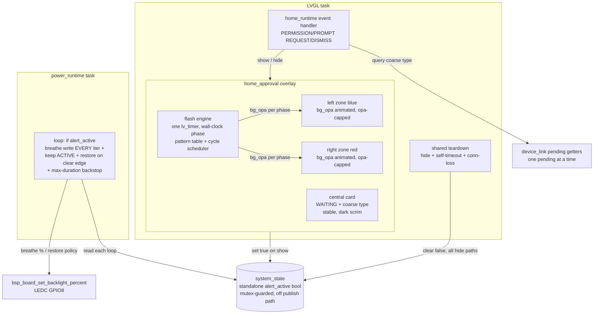

# feat: Waiting-alert police-beacon overlay

## Summary

Replace the low-salience "Claude is waiting" text panel (`src/apps/app_home/src/home_approval.c`) with a high-salience police-lightbar alert: fixed blue-left / red-right zones cycling through several authentic flash patterns, a steady centered card showing a large English word plus the coarse interaction type, and a backlight pulse driven through `power_runtime` as an additional peripheral channel. Stays read-only — no trigger, protocol, or decision-semantics change. Built on the existing LVGL overlay, not the screensaver's direct-mode pipeline.

---

## Problem Frame

`home_approval.c` today is a 90%-opaque panel carrying two 11px labels — a muted "Claude is waiting" and one line of coarse type. No motion, no strong color, no large text. When Claude blocks for a permission/elicitation/question, the device gives no peripheral cue, so the wait is easily missed — which defeats the device's core job as a status notifier.

The board has no buzzer or LED (`bsp_board_config.h` defines neither), so the only alert channels are the screen itself and the backlight PWM (`BSP_LCD_BACKLIGHT`, GPIO8). The backlight is owned exclusively by `power_runtime`, which writes the LEDC channel from the active power policy — so any pulse has to be modulated there, not written independently by the overlay.

---

## Requirements

Traced from origin (`docs/brainstorms/2026-06-25-waiting-alert-beacon-requirements.md`):

- **R1** — Full-screen lightbar: fixed blue-left, red-right zones. → U1
- **R2** — Auto-cycle through several authentic patterns (wig-wag, quad, triple, single, simultaneous, quint), with the full-field flash held below the photosensitivity threshold on all three WCAG 2.3.1 axes (rate **and** flashed area **and** relative-luminance delta); the central card stays stable, never flashes. → U2
- **R3** — Steady centered card: large word + coarse type, readable over the densest pattern (dark scrim / outline). → U1, U3
- **R4** — Backlight pulses while the alert is up, owned by `power_runtime`/power policy via an alert-active flag (not an independent overlay write); returns to the policy value on dismiss; alert visuals work even when the backlight write path is unavailable. → U4
- **R5** — Card shows only the coarse interaction type; never command, argument, or option content. → U3
- **R6** — Device returns no decision; pure notification, existing read-only semantics. → U1, U3
- **R7** — Trigger/dismiss unchanged: `PERMISSION_REQUEST`/`PROMPT_REQUEST` show; `*_DISMISS` / connection loss / 5-minute self-timeout hide. → U1, U4
- **R8** — Before showing: keep existing behavior (exit screensaver, poke activity). → unchanged in `home_runtime.c`
- **R9** — LVGL path, reworking the existing `home_approval` overlay; not the direct-mode pipeline. → U1, U2
- **R10** — Highest-priority interaction is shown. The device holds **at most one** pending interaction at a time: `device_link` evicts a pending prompt when an approval arrives and refuses a new prompt while an approval is pending (existing preemption — `set_pending_approval`/`set_pending_prompt`). So the card always shows exactly one coarse type; when an approval preempts a pending prompt the card switches to the approval type via the existing show path; on dismiss/timeout/disconnect the alert hides. No "+N waiting" marker and no switch-to-next-on-dismiss are built — both are unreachable under this protocol (see KTD5). → U1, U3

---

## Key Technical Decisions

**KTD1 — LVGL overlay, single timer, wall-clock phase.** Rework the existing `home_approval` LVGL overlay (R9); do not touch the screensaver's direct-mode pipeline. One repeating `lv_timer` (~50ms) drives both zones' opacity. Phase is derived from elapsed wall-clock time (`lv_tick_get` / `esp_timer_get_time`) inside the callback, **not** from a "one callback = 50ms step" assumption — LVGL coalesces and delays timer callbacks under load (the home task also runs screensaver/sprite/bubble timers), and a fixed-step assumption would let a late, bunched tick render two bright frames closer together than the safety cap allows. Timer runs only while the overlay is visible.

**KTD2 — Fixed zones as two sibling layers, card on top.** Left and right zones are two full-height sibling objects under the overlay (left = blue, right = red), drawn first; the card is a third sibling on top at fixed center, never animated. Zones span behind the card full-width; only the zone edges show past the card, so flashing never moves geometry. Concrete layout in U1.

**KTD3 — Photosensitivity cap on all three axes, with a self-check that is necessary-but-not-sufficient.** WCAG 2.3.1's general-flash threshold is a function of flashed **area**, relative-**luminance** delta, **and** rate — not rate alone. Two full-height saturated red/blue zones flipping opacity is a large-area, high-contrast flash, so a rate-only guard can log "pass" while the actual luminance swing still exceeds the threshold. Defense:
- **Area/luminance bound by construction:** zone colors are luminance-limited (not raw max-saturation red/blue), and a full-field bright frame caps each zone's `bg_opa` swing below a named ceiling (`BEACON_BRIGHT_OPA`) so the relative-luminance delta of any simultaneous-bright transition stays under threshold.
- **Rate bound by the table:** a "full-field bright transition" is defined concretely — both zones crossing `BEACON_BRIGHT_OPA` within one tick — and no two such transitions occur closer than `BEACON_BRIGHT_MIN_INTERVAL_MS` (≥ ~350ms), giving < 3/sec.
- **Rate self-check:** a runtime check (run once at create, logged pass/FAIL like `ss_glyph_selftest`) scans the table **and every adjacent-pattern dwell boundary** (the scheduler concatenates patterns, so the last bright frame of one and the first of the next can stack) asserting the min-interval holds. The plan states explicitly that this check covers only the rate axis; area/luminance is enforced by the color/opacity ceiling above, and final confirmation is on-device photometric judgment (a Risk).

**KTD4 — English big word, existing fonts, concrete readable card.** The big word is fixed as `"WAITING"` for every interaction type (an attention cue, not a classifier; `BEACON_BIG_WORD` constant) in `ui_font_display_44` (zero new font cost); coarse type uses `ui_font_text_22`. The card scrim is concrete: background `0x000000` at ≥ `LV_OPA_80`, a high-contrast 1px border, sized `BEACON_CARD_W`×`BEACON_CARD_H` centered — minimums, raised if on-device testing shows bleedthrough. No new CJK font (Chinese big text deferred — see Scope).

**KTD5 — One pending interaction at a time (preemption, not coexistence).** `device_link` cannot hold an approval and a prompt simultaneously: `set_pending_approval` clears any pending prompt, and `set_pending_prompt` returns `ESP_ERR_INVALID_STATE` while an approval is pending (verified in `device_link.c`). So a "+N waiting" marker and a switch-to-next-on-dismiss path would be dead code. The card shows the single pending type; preemption (approval arriving over a pending prompt) surfaces naturally because the approval request posts `APP_EVENT_PERMISSION_REQUEST` → `home_approval_show_pending` re-queries and shows the approval type. On dismiss the existing unconditional hide is correct (nothing else can be pending). Displaying two concurrent requests would require redesigning `device_link`'s preemption model, which is out of scope.

**KTD6 — Backlight pulse owned by `power_runtime`, written every loop, restored on the clear edge.** A single `alert_active` flag lives in `system_state` as a standalone mutex-guarded bool — **not** a field on the power-policy input and **not** routed through `recompute_locked`/`publish_power_changed`, so toggling it never spams `APP_EVENT_POWER_CHANGED` (which would force an `apply_policy_output` that fights the breathe). The overlay sets it true on show and clears it through a **single shared teardown** used by every hide path — `home_approval_hide`, the self-timeout callback (which today bypasses `home_approval_hide`), and connection-loss — so no path can leak the flag and pin the backlight. `power_runtime`, each loop iteration while the flag is set, computes a time-based breathe (period ~1.6s, ≈0.6Hz) and writes `policy_brightness × factor` (~0.4–1.0) — the existing loop only writes the backlight on a queued `POWER_CHANGED`, so this is a new per-loop write, not a reuse of `apply_policy_output`. On the flag's true→false edge it writes the policy brightness once to restore it (no `POWER_CHANGED` is guaranteed to arrive). While active it keeps `DISPLAY_STATE_ACTIVE` (suppresses idle-dim) and applies a max-duration backstop mirroring the overlay's 5-minute self-timeout so a wedged producer can't pin the backlight forever. To make the breathe smooth, the queue-receive timeout is shortened to ~40ms while active (required for smoothness, not cosmetic — at the 200ms cadence a 1.6s period is only ~8 visibly stepped samples). Lock order holds: `power_runtime` reads `system_state` (service mutex) and never touches LVGL. *(Alternative considered: have `power_runtime` read `device_link` pending getters directly and drop the flag entirely — rejected to avoid a `power_runtime → device_link` dependency that inverts the layer direction; `home_approval` already owns the show/hide lifecycle and is the natural flag setter.)*

---

## High-Level Technical Design

Component and data flow:

Pattern table shape (illustrative, directional — final keyframes resolved in U2; order matches R2):

| Pattern | Behavior | Full-field bright rate |
|---|---|---|
| wig-wag | left double-blink → right double-blink, alternating | side-alternating, net luminance steady |
| quad | 4-burst per side then swap | ≤ cap |
| triple | 3-burst per side then swap | ≤ cap |
| single | one side at a time, fast alternation | ≤ cap |
| simultaneous | both zones flash together | **capped: < 3/sec AND opa ≤ BEACON_BRIGHT_OPA** |
| quint | 5-burst both zones | **capped: < 3/sec AND opa ≤ BEACON_BRIGHT_OPA** |

Each pattern holds for a dwell (~2–3s); the scheduler advances and wraps, inserting a forced steady gap at each boundary so two bright frames never stack.

---

## Implementation Units

### U1. Restructure the overlay into zones + a stable card

- **Goal:** Replace the 90%-panel + two 11px labels with the beacon layout — left zone, right zone, centered card — while keeping show/hide/self-timeout/connection-loss behavior intact, and route all hide paths through one shared teardown. No flashing yet (zones static), card shows the coarse type as today.
- **Requirements:** R1, R3, R6, R7, R9, R10 (preemption display).
- **Dependencies:** none.
- **Files:** `src/apps/app_home/src/home_approval.c`, `src/apps/app_home/src/home_approval.h`, `src/apps/app_home/src/home_internal.h` (beacon color/size constants).
- **Approach:** Extend `home_approval_t` with the two zone objects, the card object, and its labels (replacing `status_label`/`type_label`). In `home_approval_create`, build: full-screen container (no touch handlers — read-only), left zone (blue) and right zone (red) as full-height siblings spanning full width, then the card on top, centered, sized `BEACON_CARD_W`×`BEACON_CARD_H`, with a dark scrim (`0x000000` ≥ `LV_OPA_80`) + border. Define `BEACON_ZONE_BLUE`, `BEACON_ZONE_RED` (luminance-limited, per KTD3), `BEACON_BRIGHT_OPA`, `BEACON_CARD_*`, `BEACON_BIG_WORD` in `home_internal.h`. Introduce one shared teardown helper that hides the overlay and (in U4) clears the alert flag; point `home_approval_hide`, `approval_timeout_cb` (today it sets `LV_OBJ_FLAG_HIDDEN` directly), and the connection-loss path at it. Keep `home_approval_show_pending` selecting the pending type (approval wins; preemption surfaces the new type automatically).
- **Patterns to follow:** existing `home_approval_create` overlay construction; `home_internal.h` color/const conventions (`APPROVE_BG_COLOR`); screensaver overlay's full-screen sibling layout.
- **Test scenarios** (on-device — no host test harness for LVGL/firmware; verified by flashing + `chibi` triggers as in the screensaver work):
  - `Covers R7.` Trigger a permission request → full-screen overlay with blue-left/red-right zones and the card showing the coarse type. Dismiss → hides, no residue.
  - `Covers R6.` Touching the overlay does nothing (no handler, no decision).
  - `Covers R10.` With a prompt showing, an approval arrives → card switches to the approval type (preemption via `show_pending`).
  - Connection lost while visible → clears via the shared teardown. 5-minute self-timeout → clears via the shared teardown.
- **Verification:** New three-region layout renders; every hide path (dismiss, timeout, connection-loss) goes through the one teardown; preemption shows the new type; no touch handler.

### U2. Flash-pattern engine, cycle scheduler, and photosensitivity guard

- **Goal:** Drive the two zones through the authentic pattern set, auto-cycling, with the full-field flash bounded on rate, area, and luminance.
- **Requirements:** R2, R9.
- **Dependencies:** U1.
- **Files:** `src/apps/app_home/src/home_approval.c`, `src/apps/app_home/src/home_approval.h` (engine state on `home_approval_t`). Keep the pattern table inline as a `static const` array — no separate file (extraction is trivial later if it grows).
- **Approach:** A static pattern table in R2 order (wig-wag, quad, triple, single, simultaneous, quint), each entry describing per-zone keyframes (opacity capped at `BEACON_BRIGHT_OPA`) and a dwell. One repeating `lv_timer` (~50ms) computes each zone's `bg_opa` from the active pattern and a **wall-clock-derived phase** (elapsed `esp_timer`/`lv_tick` delta, not callback count). The scheduler advances `active_pattern` when its dwell elapses, inserting a forced steady gap so no two full-field bright frames stack across a boundary. Start the timer in `home_approval_show_pending`, delete it in the shared teardown.
- **Execution note:** Build the photosensitivity self-check first — a function that scans every table entry **and every adjacent-pattern boundary** and asserts no two full-field bright transitions fall within `BEACON_BRIGHT_MIN_INTERVAL_MS` — run it once at create with a pass/FAIL log line (mirrors `ss_glyph_selftest`), before wiring the live timer. State in a comment that this guards the rate axis only; area/luminance is bounded by `BEACON_ZONE_*` and `BEACON_BRIGHT_OPA`.
- **Patterns to follow:** `screensaver_glyphs.c` `ss_glyph_selftest` self-check style; `lv_timer` create/delete lifecycle in `approval_arm_timeout`; screensaver effect-table registry shape in `screensaver_effects.c`.
- **Test scenarios** (on-device):
  - `Covers AE1 / R2.` Hold the alert visible several seconds → the visible pattern changes between entries.
  - `Covers R2.` `simultaneous`/`quint` full-screen brights are visibly spaced (no faster than ~2–3/sec) and never reach full opacity.
  - Self-check logs `pass` at create; deliberately under-spacing a table entry or boundary in a scratch build logs `FAIL` (developer check, not shipped).
  - Hide → timer deleted (no residual animation or CPU spin).
- **Verification:** Patterns cycle in R2 order; rate self-check (entries + boundaries) passes; zone opacity never exceeds the bright cap; timer torn down on hide.

### U3. Central card content — fixed big word + coarse type

- **Goal:** Fill the stable card with the fixed big English word and the single coarse interaction type, readable over the densest pattern, type-only (read-only).
- **Requirements:** R3, R5, R6, R10 (single type).
- **Dependencies:** U1.
- **Files:** `src/apps/app_home/src/home_approval.c`, `src/apps/app_home/src/home_approval.h`.
- **Approach:** Card holds a fixed big-word label (`BEACON_BIG_WORD` = "WAITING", `ui_font_display_44`) and a coarse-type label (`ui_font_text_22`). In `home_approval_show_pending`, select the type per KTD5 (approval wins; else prompt) and preserve the existing empty-string fallback (today: `(type && type[0]) ? type : "Request"`) so the type slot is never blank. Never read or display command/argument/option fields. No "+N waiting" line (unreachable, KTD5). Card keeps its dark scrim + border so contrast holds over flashing zones.
- **Patterns to follow:** existing `home_approval_show_pending` type selection and `"Request"` fallback; `ui_fonts` accessors; `LV_LABEL_LONG_DOT` clamp.
- **Test scenarios** (on-device):
  - `Covers AE2 / R3, R5.` Under the densest pattern → "WAITING" + coarse type are clearly legible; only the type shows (no command/argument text).
  - A pending request with an empty `type_label` → card shows the `"Request"` fallback, never blank.
  - Permission vs prompt → the coarse type differs; the big word stays "WAITING".
- **Verification:** Card shows the fixed big word + the single coarse type, stays readable over flashing, never renders content beyond the coarse type, never blank.

### U4. Backlight pulse via `power_runtime` (alert-active flag)

- **Goal:** Pulse the backlight while the alert is up, owned by `power_runtime`, restoring the policy brightness when the alert clears, with alert visuals unaffected when the backlight write path is unavailable.
- **Requirements:** R4.
- **Dependencies:** U1 (shared teardown clears the flag), U2 (alert visuals independent of this unit).
- **Files:** `src/components/core_system_state/` (add a standalone `alert_active` bool + mutex-guarded get/set — header + src), `src/components/power_runtime/src/power_runtime.c`, `src/apps/app_home/src/home_approval.c` (set the flag on show, clear it in the shared teardown).
- **Approach:** Add `system_state_set_alert_active(bool)` / `system_state_get_alert_active(void)` backed by a new static bool under `s_mutex`, defaulting false — **not** a field on the policy input and **not** through `recompute_locked`/`publish_power_changed` (toggling must not emit `APP_EVENT_POWER_CHANGED`). `home_approval_show_pending` sets it true; the shared teardown (hide + self-timeout + connection-loss) sets it false. In `power_runtime_task`, after the `xQueueReceive` timeout, when the flag is set: write the breathe value **every iteration** (the existing loop writes the backlight only on a queued `POWER_CHANGED`), keep `DISPLAY_STATE_ACTIVE` (skip the idle-dim/sleep transition), and apply a max-duration backstop (clear/ignore after ~5 min, mirroring the overlay self-timeout). On the flag's true→false edge, write `power_policy_get_output().brightness_percent` once to restore. Shorten the queue-receive timeout to ~40ms while active for breathe smoothness. AE4 holds because the alert visuals (U1–U3) are independent LVGL objects and the modulation goes through `bsp_board_set_backlight_percent`, which no-ops when the backlight layer is not ready — note that backlight *init* failure currently aborts boot at `bsp_display.c:530` (so the "device runs without backlight" state is reached via the runtime no-op guard, not via a survived init failure; do not claim init is non-fatal).
- **Patterns to follow:** `system_state` mutex-guarded accessors (e.g. `system_state_set_display_state`) for the lock idiom only — the new flag stays off the recompute/publish path; `power_runtime.c` task loop structure; `power_policy_get_output`.
- **Test scenarios** (on-device):
  - `Covers R4.` Trigger an alert → backlight visibly breathes; dismiss → brightness settles back to the policy value (no stuck duty).
  - `Covers AE4 / R4.` With the backlight write path unavailable (no-op guard) → alert visuals still work, no crash.
  - Let the 5-minute self-timeout fire → backlight settles to policy and idle-dim resumes (flag cleared via shared teardown; no leak).
  - Alert active >15s on battery → display stays ACTIVE (no idle dim) until cleared.
  - `POWER_CHANGED` during an active alert → no stuck modulated brightness after dismiss.
- **Verification:** Backlight breathes during the alert and returns to policy brightness on every clear path (dismiss, timeout, connection-loss); idle-dim suppressed while active; flag never leaks; visuals unaffected when the write path is unavailable.

---

## Scope Boundaries

In scope: reworking the `home_approval` overlay into the beacon (zones + cycle + card), the single-pending preemption display, and the `power_runtime`-owned backlight pulse.

Not in scope (true non-goals, per origin):
- No change to trigger sources, the `device_link` protocol (including its one-pending-at-a-time preemption model), or read-only semantics.
- No sound (no buzzer on the board); the backlight is the only non-screen channel.
- No on-device decisions; never display command/argument/option content.
- No progressive "quiet banner → escalate after N seconds" design; the alert is the beacon cycle from the first frame.
- ASCII screensaver is a separate effort (`docs/brainstorms/2026-06-25-ascii-screensaver-library-requirements.md`).

### Deferred to Follow-Up Work
- Chinese (CJK) big-word rendering — needs a new ~44px CJK font baked into flash; English chosen for v1 (KTD4).
- Concurrent display of multiple pending interactions — would require a `device_link` preemption-model redesign (currently one-at-a-time); out of scope.
- Tuning pass on exact per-pattern dwell/keyframe timings, zone colors, and breathe amplitude after first on-device viewing.

---

## Risks & Dependencies

- **Photosensitivity (seizure) risk — load-bearing, and the self-check is necessary-but-not-sufficient.** Full-screen blue/red flashing is exactly the hazard WCAG 2.3.1 guards against, and the threshold depends on flashed area and relative-luminance delta, not just rate. The U2 self-check bounds **only** the rate axis; area/luminance is bounded by construction (luminance-limited zone colors + `BEACON_BRIGHT_OPA` opacity ceiling per KTD3). True confirmation is on-device photometric judgment of the actual luminance swing on the AXS15231B panel — treat first-light review as a safety gate, not a formality. This constraint overrides "more flashing = more salience."
- **Sightline assumption (from review, confidence 75).** Every decision is made on the Mac's native prompt, so the user's eyes are likely on the Mac, not the device — a full-screen flash on a small desk device may still fall outside central vision. The backlight pulse (U4) is the channel most likely to reach peripheral vision, so it is treated as first-class. If real-world use shows the screen flash adds little, elevate the backlight further.
- **Alarm fatigue (from review, confidence 75).** A fixed max-intensity alert on every request can habituate into background noise; there is no escalation gradient (out of scope per origin). Recorded as a known risk; the real success signal is missed-request rate after ~a week of normal use, not first-impression visibility.
- **Multi-pattern cycle vs. binary signal (from review, confidence 100).** Kept deliberately per the user's brainstorm decision; the 1–2-pattern simplification remains the obvious fallback if the cycle proves not worth its complexity.
- **Dependency:** existing `device_link` pending getters, coarse `type_label`, and one-pending-at-a-time preemption (`set_pending_approval`/`set_pending_prompt`); `bsp_board_set_backlight_percent` (exists; no-op when backlight layer not ready); `power_runtime` ownership of the LEDC channel; `system_state` mutex hub for the new standalone flag (off the publish path).

---

## Acceptance Examples (origin trace)

- **AE1** (patterns visibly cycle) → U2 test scenarios.
- **AE2** (big word + type legible under densest pattern; type-only) → U3 test scenarios.
- **AE3** (dismiss / connection loss → immediate hide, no residue) → U1, U4 (shared teardown) test scenarios.
- **AE4** (backlight write path unavailable → visuals fine, no crash; reached via the runtime no-op guard, not a survived init failure) → U4 test scenarios.
- **AE5 (reframed)** — single-pending preemption: a prompt is showing, an approval arrives → it preempts the prompt and the card switches to the approval type. (Origin's "two pending, dismiss one, other stays" is unreachable under `device_link`'s one-at-a-time model — KTD5.) → U1 test scenarios.

---

## Sources & Research

- Current overlay: `src/apps/app_home/src/home_approval.c` / `.h` (90% panel + two 11px labels; 5-min self-timeout via `approval_timeout_cb`, which sets `LV_OBJ_FLAG_HIDDEN` directly and bypasses `home_approval_hide`; connection-loss clear; read-only, no touch; existing empty-`type_label` → `"Request"` fallback).
- Trigger wiring: `src/apps/app_home/src/home_runtime.c:339-354` (PERMISSION/PROMPT REQUEST/DISMISS; `exit_screensaver` + `home_screensaver_poke_activity` before show; dismiss currently calls `home_approval_hide`).
- Pending state model: `src/components/device_link/src/device_link.c` (`set_pending_approval` clears any pending prompt; `set_pending_prompt` returns `ESP_ERR_INVALID_STATE` while an approval pends — at most one pending; `get_pending_*` / `dismiss_*`).
- Backlight ownership: `src/components/power_runtime/src/power_runtime.c` (200ms loop; `apply_policy_output` → `bsp_board_set_backlight_percent` is called **only** on a queued `POWER_CHANGED`, not per-poll); `src/components/bsp_board/src/bsp_display.c:530` (`bsp_backlight_init` failure aborts boot via `ESP_RETURN_ON_ERROR`; runtime `bsp_backlight_set_percent` no-ops when not ready).
- Fonts: `src/components/ui_fonts/include/ui_fonts.h` (`ui_font_text_11/22`, `ui_font_display_44`); `noto_sans_cjk_12` exists only at 12px.
- Cross-task state hub: `src/components/core_system_state/` (mutex-guarded accessors; the new `alert_active` bool must stay off the `recompute`/`publish_power_changed` path).
- Read-only constraint: `CLAUDE.md` (device is a read-only notifier; coarse type only; decision RPC paths removed).
- Self-check pattern: `src/apps/app_home/src/screensaver_glyphs.c` `ss_glyph_selftest`.
- Lightbar pattern reference (origin): real emergency-lightbar naming and flash rates — wig-wag, single/triple/quad/quint, simultaneous, cycle; FPM (75/150/210). SpeedTech Alpha flash-pattern list, Federal Signal MicroPulse, strobesnmore "Decoding Flash Patterns".
