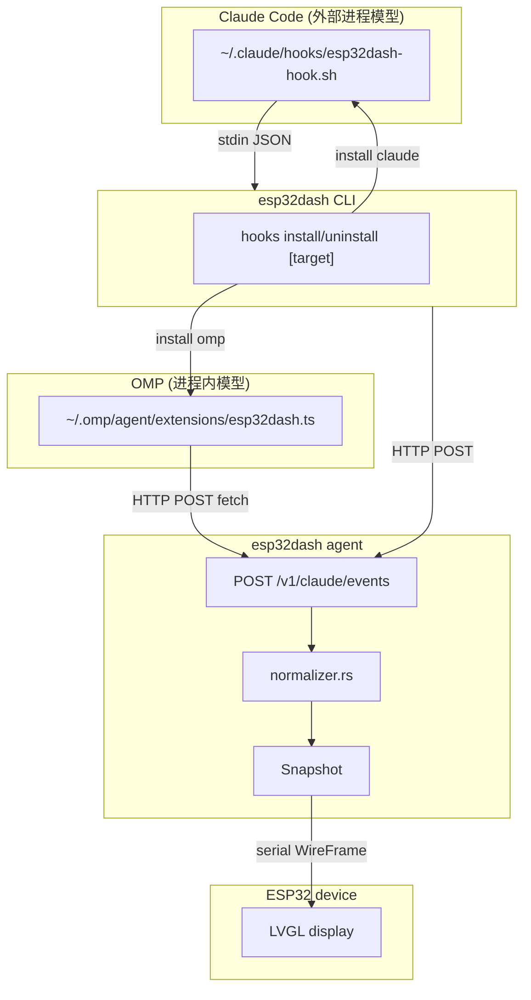

## Goal Capsule

- **Objective:** 让 esp32dash 同时支持 Claude Code 和 OMP 两个 agent 的 hook 事件转发，设备显示统一的 agent 状态。
- **Product authority:** 用户确认范围：OMP 只做被动状态转发（session/turn/tool 事件），不触发设备 overlay；两路事件 last-event-wins 共享同一个 snapshot；两个 target 安装互不干扰。
- **Execution profile:** Rust CLI 重构 + 新增 TypeScript extension 文件。
- **Stop conditions:** `hooks install claude` 和 `hooks install omp` 各自可独立安装/卸载；OMP extension 能把 session/turn/tool 事件转发到设备并正确显示状态。
- **Tail ownership:** 实现者负责按 U-ID 顺序执行、写测试、跑 `cargo test` 和 `cargo build`。

---

## Product Contract

### Summary

为 esp32dash 增加 OMP hook 集成。OMP extension 监听 agent lifecycle 事件，在边缘翻译成 Claude 兼容的 JSON 格式后复用现有 ingest 管道。CLI 从 `install-hooks` 重构为 `hooks install|uninstall [target]`，claude 和 omp 两个 target 独立安装。

### Problem Frame

当前 esp32dash 只支持 Claude Code 的 hook 系统——通过 `~/.claude/hooks/esp32dash-hook.sh` 收集事件并转发到 agent。用户同时使用 OMP 时，设备无法显示 OMP 的 agent 状态。两套 hook 系统架构完全不同：Claude Code 是外部进程模型（shell 脚本收 stdin JSON），OMP 是进程内模型（JS/TS extension 注册回调）。但由于设备只关心粗粒度状态（started / processing / using tool / waiting / ended），在 extension 边缘做事件格式翻译后，可以复用现有的 agent ingest 管道和设备协议，零改动。

### Requirements

**OMP 状态转发**

- R1. OMP extension 能将 session lifecycle 事件（session_start、session_shutdown）转发到 esp32dash agent，设备显示 "Session started" / "Session ended"。
- R2. OMP extension 能将 turn lifecycle 事件（turn_start、turn_end）转发到 agent，设备显示 "Processing prompt" / "Idle"。
- R3. OMP extension 能将 tool lifecycle 事件（tool_call）转发到 agent，设备显示 "Running tool: \<tool_name\>"。
- R4. OMP extension 在 agent 不可达时静默失败，不阻塞 OMP 正常运行。

**CLI 重构**

- R5. `hooks install [target]` 支持安装 claude 和 omp 两个 target，省略 target 时安装全部。
- R6. `hooks uninstall [target]` 支持卸载 claude 和 omp 两个 target，省略 target 时卸载全部。
- R7. 旧的 `install-hooks` 命令保留为 `hooks install claude` 的别名，行为完全一致。
- R8. claude 和 omp 的安装/卸载互相独立，安装 omp 不影响已安装的 claude hooks，反之亦然。

**OMP extension 交付**

- R9. `hooks install omp` 生成一个自包含的 TypeScript extension 文件到 `~/.omp/agent/extensions/esp32dash.ts`，依赖 OMP 的自动发现机制生效，无需手动改 config.yml。

### Scope Boundaries

**Deferred for later**

- OMP approval overlay——OMP 的审批是进程内处理（`ctx.ui.confirm`），不发射外部事件，无法可靠触发设备 overlay。需要 OMP 上游新增 approval_request hook 事件才有可行性。
- 设备 source 区分（分 claude / omp 两路显示）——当前 last-event-wins 够用，多 source 显示需要改 agent 状态模型和设备协议。

**Outside this product's identity**

- 修改 OMP 或 Claude Code 本身。

---

## Planning Contract

### Key Technical Decisions

**KTD1. Edge adapter pattern — OMP 事件在 extension 边缘翻译成 Claude 兼容格式，agent core 零改动。**

OMP extension 把原生事件名映射到 Claude 的 `hook_event_name` 语义（如 `turn_start` → `UserPromptSubmit`，`tool_call` → `PreToolUse`），构造 `LocalHookEvent` 兼容的 JSON payload 后 POST 到 agent 的 `/v1/claude/events` 端点。agent 的 normalizer 照常映射，snapshot 照常更新，设备协议不变。代价是 OMP 语义被套进 Claude 事件名，但设备只显示粗粒度状态，语义损耗可忽略。另一种选择（给 OMP 单开 `omp ingest` 路径 + 扩展 normalizer 认识 OMP 原生事件名）更"正确"但维护成本翻倍，对需求没有实际收益。

**KTD2. OMP extension 通过 HTTP fetch 直接 POST 到 agent 端点，不走 CLI 子进程。**

OMP extension 跑在 Bun 运行时里，有完整的 `fetch` 和 Node 标准库访问权限（参考 OMP issue #1359 的 file-snapshot extension 直接用 `fs/promises`）。直接用 `fetch` POST 到 `http://127.0.0.1:37125/v1/claude/events` 比 shell out 到 `esp32dash claude ingest --event-from-stdin` 更轻量——不依赖 `esp32dash` 在 PATH 里，不 spawn 子进程，延迟更低。端点地址从环境变量 `ESP32DASH_ADMIN_ADDR` 读取，缺省回退到 `127.0.0.1:37125`（与 `compat.rs` 的 `DEFAULT_ADMIN_ADDR` 一致）。

**KTD3. CLI 重构为 `hooks` 子命令树，旧命令保留为别名。**

`install-hooks` 变成 `hooks install` 的一个 target，新增 `hooks uninstall`。旧 `install-hooks` 保留为 `hooks install claude` 的别名——dispatch 到同一个 handler，行为一致。这是向后兼容的最低成本路径，避免破坏现有用户的工作流和文档。

**KTD4. OMP extension 文件由 CLI 渲染并写入，而非手动放置。**

`hooks install omp` 在 Rust 侧用模板字符串渲染 TypeScript extension 源码，写入 `~/.omp/agent/extensions/esp32dash.ts`。与 Claude 侧的 `render_hook_script` 模式一致——CLI 负责生成所有 target 的安装产物。OMP 的自动发现机制（`~/.omp/agent/extensions/*.ts`）确保写入后无需改 config.yml 即生效。

### High-Level Technical Design

OMP → Claude 事件名映射：

| OMP event | Claude `hook_event_name` | 设备显示 |
|---|---|---|
| `session_start` | `SessionStart` | Session started |
| `session_shutdown` | `SessionEnd` | Session ended |
| `turn_start` | `UserPromptSubmit` | Processing prompt |
| `turn_end` | `Stop` | Idle |
| `tool_call` | `PreToolUse` | Running tool: \<tool_name\> |

### Assumptions

- OMP extension 的 `tool_call` handler 收到的 `event` 对象包含 `event.toolName` 字段（OMP hooks 文档确认此字段存在）。
- OMP extension 的 `session_start` / `turn_start` handler 的 `ctx` 提供 `ctx.cwd`（OMP 文档确认）。
- OMP extension 没有可靠的 session ID 获取方式时，使用从 `ctx.sessionManager` 读到的 ID 或回退到 `"omp-session"` 占位值。session_id 只用于 agent 侧的 snapshot 跟踪，last-event-wins 模式下不影响显示。
- `ESP32DASH_ADMIN_ADDR` 环境变量在 OMP extension 运行时可读（OMP 进程继承 shell 环境）。

### Sources & Research

- `tools/esp32dash/src/hooks.rs:233-270` — `render_hook_script` 模式，Claude 侧的模板渲染安装产物
- `tools/esp32dash/src/main.rs:686-712` — `ingest_from_stdin`，事件流经 HTTP POST 到 agent
- `tools/esp32dash/src/agent.rs:1244-1257` — agent 的 `/v1/claude/events` 端点路由
- `tools/esp32dash/src/normalizer.rs:13-139` — 事件名到 title/detail/status 映射
- `tools/esp32dash/src/model.rs:64-81` — `LocalHookEvent` 结构（OMP extension 须构造兼容的 JSON）
- `tools/esp32dash/src/compat.rs:3,14-16` — `DEFAULT_ADMIN_ADDR` 和 `admin_addr()` 的环境变量回退逻辑
- OMP `docs/hooks.md` — hook 事件目录和 `HookAPI` factory 签名
- OMP `docs/extensions.md` — `ExtensionAPI`，`pi.on()` 事件注册，extension 自动发现路径
- OMP `docs/extension-loading.md` — `~/.omp/agent/extensions/*.ts` 自动发现，无需 config.yml
- OMP issue #1359 — file-snapshot extension 示例，演示 `session_start`/`turn_start`/`turn_end` handler + `ctx` 上下文读取
- OMP `docs/skills/examples/safety-hook/` — 最小 extension factory 骨架

---

## Implementation Units

### U1. CLI 子命令重构：`hooks install|uninstall [target]`

- **Goal:** 将 `install-hooks` 重构为 `hooks` 子命令树，支持 claude/omp 两个 target 的安装和卸载。
- **Requirements:** R5, R6, R7, R8
- **Dependencies:** 无（U1 引入 coordinator 和各 target 的 analyze/apply stub 签名，使本单元可独立编译；U2/U3 提供函数体）
- **Files:**
  - `tools/esp32dash/src/main.rs` — 修改 CLI 命令枚举，新增 `Hooks` 子命令树和 `UninstallHooksArgs`，保留旧 `InstallHooks` 作为别名 dispatch（解包 `.claude` 保持扁平 JSON）
  - `tools/esp32dash/src/hooks.rs` — 重构 `install_hooks` 为 coordinator，新增 `uninstall_hooks` 函数，新增 `HookTarget` enum（`Claude` / `Omp` / `All`）；引入 `analyze_omp` / `apply_omp` / `uninstall_claude_hooks` / `uninstall_omp_hooks` 四个 stub 签名（`todo!()` 体）；Claude 侧复用现有 `analyze_install` / `apply_install`，不需新 stub。使 U1 独立编译，U2/U3 替换为真实实现
- **Approach:**
  - 在 `Command` enum 中新增 `Hooks { command: HooksCommand }` 变体，其中 `HooksCommand` 是 `Install { target: Option<HookTarget>, force: bool }` 和 `Uninstall { target: Option<HookTarget> }` 的子枚举。
  - `HookTarget` 是 clap derive enum，`clap(value_enum)`，variants: `Claude`, `Omp`, `All`（default `All` when omitted）。
  - 旧 `InstallHooks(InstallHooksArgs)` 保留：dispatch 到 `hooks::install_hooks(executable, force, HookTarget::Claude)`，但在 `main.rs` 的 wrapper 中解包返回的 `HooksResult.claude` 字段，序列化扁平的 `InstallHooksResult` 到 stdout——保持旧命令的 JSON 契约不变（R7 行为完全一致）。仅 `hooks install [all|omp]` 路径序列化嵌套 `HooksResult`。
  - `install_hooks` 作为 coordinator：按 target 调用 `analyze_install`/`analyze_omp` 收集各 target 的 analysis，合并为一条 confirm message（`force=false` 时用户确认一次），然后统一调用 `apply_install`/`apply_omp`。返回 `HooksResult`（`claude: Option<InstallHooksResult>`, `omp: Option<OmpInstallResult>`，`{extension_path, extension_written}`）。未安装的 target 为 `None`。`hooks install [all|omp]` 路径序列化嵌套 `HooksResult`。
  - `uninstall_hooks(target) -> Result<UninstallHooksResult>` 按 target 分发到 `uninstall_claude_hooks` 和 `uninstall_omp_hooks`。
  - `uninstall_claude_hooks`：从 `~/.claude/settings.json` 的 hooks 对象中移除所有 esp32dash 相关条目（通过 `command_hook_matches` 判断），删除 `~/.claude/hooks/esp32dash-hook.sh`（如果存在且无其他引用）。
  - `uninstall_omp_hooks`：删除 `~/.omp/agent/extensions/esp32dash.ts`（如果存在）。
- **Patterns to follow:** `tools/esp32dash/src/hooks.rs:123-218`（`install_hooks` / `analyze_install` / `apply_install` 的 analyze→confirm→apply 三段式）；`tools/esp32dash/src/hooks.rs:286-376`（`ensure_settings_hooks` / `ensure_hook_entry` 用于 settings.json 操作）；`tools/esp32dash/src/hooks.rs:388-398`（`command_hook_matches` 用于条目判断）
- **Test scenarios:**
  - **CLI structure:** `HookTarget` enum 正确解析 `claude`/`omp`/`all` 三个值，省略时默认 `All`
  - **CLI structure:** `HooksCommand::Install` 和 `HooksCommand::Uninstall` 子命令正确解析
  - **Compat:** 旧 `install-hooks` 命令 dispatch 到 claude target，输出扁平 `InstallHooksResult` JSON（与现有格式一致）
- **Verification:** `cargo build` 无 warning（U1 不含 target 行为测试——install/uninstall 写入与清理测试在 U2/U3）。

### U2. Claude target 的 install/uninstall 提取

- **Goal:** 把现有 Claude hooks 安装逻辑提取为 `install_claude_hooks` / `uninstall_claude_hooks`，作为 `hooks install/uninstall claude` 的实现。
- **Requirements:** R5, R6, R7, R8
- **Dependencies:** U1
- **Files:**
  - `tools/esp32dash/src/hooks.rs` — Claude 侧复用现有 `analyze_install` / `apply_install`（不新建 analyze_claude/apply_claude 别名），新增 `uninstall_claude_hooks`
- **Approach:**
  - Claude install 复用现有 `analyze_install` / `apply_install`（不新建别名）。coordinator 调用 `analyze_install(executable, claude_dir)` 收集 analysis，统一 confirm 后调用 `apply_install(claude_dir, &analysis)`。保持 `HOOK_SPECS`、`render_hook_script`、`ensure_settings_hooks` 不变。
  - `uninstall_claude_hooks(claude_dir)` 新增：读取 settings.json，遍历 hooks 对象的每个 event key，移除 matcher 数组中 `command_hook_matches` 为真的 hook 条目；如果某个 matcher 的 hooks 数组移除后为空，移除该 matcher entry；如果某个 event 的 matcher 数组移除后为空，移除该 event key。最后尝试删除 hook script 文件（忽略不存在错误）。
  - `UninstallHooksResult`（`claude: Option<ClaudeUninstallResult>`, `omp: Option<OmpUninstallResult>`）与 `HooksResult` 对称——`{claude, omp}` 两字段，无额外 `ok`（成功/失败已由 `Result<UninstallHooksResult>` 承载）。`ClaudeUninstallResult` 含 `settings_path`, `script_removed`, `settings_updated`；`OmpUninstallResult` 含 `extension_path`, `extension_removed`。
- **Patterns to follow:** `tools/esp32dash/src/hooks.rs:310-376`（`ensure_hook_entry` 的逆操作逻辑——遍历、匹配、移除）；`tools/esp32dash/src/hooks.rs:388-398`（`command_hook_matches` 复用于 uninstall 的条目判断）
- **Test scenarios:**
  - **Happy path:** `hooks install claude` 在干净环境下正确写入 hook script 和 settings.json entries
  - **Happy path:** `hooks uninstall claude` 从 settings.json 移除 esp32dash 条目并删除 hook script，不影响其他 hooks
  - **Happy path:** install 后 uninstall 清除所有 esp32dash 条目，settings.json 恢复到不含 esp32dash hooks 的状态
  - **Idempotent:** uninstall 在已清理的 settings.json 上是 no-op
  - **Edge case:** settings.json 不存在时 uninstall 静默成功
  - **Edge case:** hook script 文件不存在时 uninstall 不报错
- **Verification:** `cargo test` 通过，新增的 uninstall 测试覆盖清理逻辑。

### U3. OMP extension 模板渲染

- **Goal:** 在 Rust 侧实现 `render_omp_extension()` 函数，生成自包含的 TypeScript extension 源码。
- **Requirements:** R1, R2, R3, R4, R9
- **Dependencies:** U1
- **Files:**
  - `tools/esp32dash/src/hooks.rs` — 新增 `render_omp_extension(admin_addr: &str) -> String` 和 `OMP_EXTENSION_NAME` 常量
  - `tools/esp32dash/src/hooks.rs` — 新增 `install_omp_hooks(executable, force, omp_dir)` 和 `uninstall_omp_hooks(omp_dir)`
- **Approach:**
  - `render_omp_extension` 输出一个完整的 `.ts` 文件，包含：`export default function(pi: ExtensionAPI)` factory；在 factory 内注册 5 个 `pi.on()` handler（session_start, session_shutdown, turn_start, turn_end, tool_call）；每个 handler 构造 `LocalHookEvent` 兼容的 JSON 对象（含 `session_id`, `cwd`, `hook_event_name`, `tool_name`, `permission_mode`, `recv_ts` 字段），用 `fetch` POST 到 agent 端点；fetch 失败时 catch 并静默（`console.error` 可选 debug）。`permission_mode` 固定为 `"default"`——OMP 没有 Claude 的 permission mode 概念，但 `LocalHookEvent.permission_mode` 是非可选字段，`"default"` 是 normalizer 的安全回退值（不影响任何设备状态分支）。`recv_ts` 必须使用 Unix epoch 秒（`Math.floor(Date.now() / 1000)`）——agent 侧的 `now_epoch()` 返回秒（`agent.rs:1259-1261`），JS 的 `Date.now()` 返回毫秒，1000× 的偏差会导致 session liveness/pruning 计算错误。
  - admin_addr 的默认值通过 `compat::admin_addr()` 获取并渲染进 extension 作为 fallback，但生成的 TS 代码在运行时读取 `process.env.ESP32DASH_ADMIN_ADDR`，有值时覆盖 fallback。这保证了安装后修改端口不需要重装 extension——与 Claude 侧的运行时行为一致。
  - `install_omp_hooks` 拆分为 `analyze_omp(executable, omp_dir)` 和 `apply_omp(omp_dir, analysis)` 两步（与 Claude 侧对称）。confirm 由顶层 `install_hooks` coordinator 统一合并。检查 `~/.omp/agent/extensions/` 目录是否存在（不存在则创建），渲染 extension 写入 `esp32dash.ts`。如果文件内容相同则 no-op。
  - `uninstall_omp_hooks` 删除 `~/.omp/agent/extensions/esp32dash.ts`（不存在则静默）。
  - `~/.omp/agent/` 路径解析：从 `$OMP_AGENT_DIR` 环境变量或 `$PI_CODING_AGENT_DIR` 环境变量读，回退到 `~/.omp/agent/`。与 OMP 的 `getAgentDir()` 逻辑对齐（OMP 文档：`PI_CODING_AGENT_DIR` relocates agent dir）。
- **Patterns to follow:** `tools/esp32dash/src/hooks.rs:233-270`（`render_hook_script` 的模板渲染模式——Rust `format!` + raw string literal）；`tools/esp32dash/src/compat.rs:14-16`（`admin_addr()` 环境变量回退模式）
- **Test scenarios:**
  - **Happy path:** `render_omp_extension` 输出包含 `export default function`、5 个 `pi.on()` 调用、`fetch` POST 调用
  - **Literal mapping:** `render_omp_extension` 输出的源码包含映射表中全部 5 个 Claude 事件名字面量：`"SessionStart"`、`"SessionEnd"`、`"UserPromptSubmit"`、`"Stop"`、`"PreToolUse"`——任何拼写错误会导致 normalizer 落入 `other => ("Unknown event", ...)` 分支，设备显示 Unknown event
  - **Schema round-trip:** 渲染 extension 后，从源码中重构每个 handler 会 POST 的 JSON payload（U3 的字段集），断言 `serde_json::from_str::<LocalHookEvent>` 反序列化成功且 `normalize()` 返回预期的 title/status——关闭 `cargo test`/`build`/`fmt` 无法捕获的 TS↔Rust schema 缝隙（参考 `normalizer.rs:262-430` 的测试模式）
  - **recv_ts unit:** 渲染的 extension 源码包含 `Math.floor(Date.now() / 1000)` 或等价的秒级时间戳逻辑，不含裸 `Date.now()`——毫秒级值会导致 agent 侧的 session liveness/pruning 计算错误
  - **Happy path:** 生成的 extension 包含正确的 admin_addr（默认 `127.0.0.1:37125`）
  - **Happy path:** `hooks install omp` 在干净环境下正确写入 extension 文件到 `~/.omp/agent/extensions/`
  - **Happy path:** `hooks install`（无 target）同时安装 claude 和 omp
  - **Happy path:** `hooks uninstall omp` 删除 extension 文件
  - **Happy path:** `hooks uninstall`（无 target）同时卸载 claude 和 omp
  - **Independence:** 安装 omp 不影响已安装的 claude hooks（settings.json 不变），反之亦然
  - **Idempotent:** 已安装状态下 `hooks install omp` 是 no-op
  - **Edge case:** `uninstall` 在目标不存在时静默成功（幂等），不报错
  - **Happy path:** `install_omp_hooks` 创建 `~/.omp/agent/extensions/esp32dash.ts`
  - **Idempotent:** 内容相同时 `install_omp_hooks` 是 no-op
  - **Edge case:** `uninstall_omp_hooks` 在文件不存在时静默成功
  - **Env override:** `$OMP_AGENT_DIR` 设置时写入到正确路径
  - **Env override:** `$PI_CODING_AGENT_DIR` 设置时写入到正确路径（回退）
- **Verification:** `cargo test` 通过；生成的 `.ts` 文件语法上可被 OMP 加载（手动验证：将文件放到 `~/.omp/agent/extensions/`，启动 OMP，无 import 错误）。

### U4. README 更新

- **Goal:** 更新 esp32dash README 反映新的 `hooks` 命令结构和 OMP 支持。
- **Requirements:** R5, R6, R9
- **Dependencies:** U1, U3
- **Files:**
  - `tools/esp32dash/README.md` — 更新 Commands 列表、Claude Code Hook 章节、新增 OMP Extension 章节
- **Approach:**
  - Commands 列表中 `install-hooks` 改为 `hooks install [target]` 和 `hooks uninstall [target]`，保留旧命令的说明（alias）。
  - "Claude Code Hook" 章节标题改为 "Hook Installation"，内容分 Claude 和 OMP 两小节。
  - Claude 小节保持现有内容（`hooks install claude` 等价于旧 `install-hooks`）。
  - 新增 OMP 小节：说明 `hooks install omp` 写入 extension 到 `~/.omp/agent/extensions/esp32dash.ts`，依赖自动发现，覆盖的事件类型列表。
- **Patterns to follow:** `tools/esp32dash/README.md` 现有结构和行文风格
- **Test scenarios:**
  - Test expectation: none — 文档更新，无行为变更
- **Verification:** README 内容准确反映 CLI 命令结构和两个 target 的行为。

---

## Verification Contract

| Gate | Command | Applies to |
|---|---|---|
| Unit tests | `cd tools/esp32dash && cargo test` | U1, U2, U3 |
| Build | `cd tools/esp32dash && cargo build` | U1, U2, U3 |
| Format | `cd tools/esp32dash && cargo fmt --check` | U1, U2, U3 |

---

## Definition of Done

- **Global:**
  - `hooks install [claude|omp|all]` 和 `hooks uninstall [claude|omp|all]` 各自工作正常
  - 旧 `install-hooks` 命令作为 `hooks install claude` 别名仍可用
  - OMP extension 文件可被 OMP 自动发现并加载，不产生 import 错误
  - OMP session/turn/tool 事件转发到设备后，设备显示正确的状态文本
  - `cargo test` 全绿，`cargo build` 无 warning
  - README 准确反映新命令结构

- **Per-unit:**
  - U1: CLI 子命令树结构正确，`hooks install/uninstall` 各 target 可用，旧命令兼容
  - U2: Claude install/uninstall 逻辑提取完毕，uninstall 清理干净且保留其他 hooks
  - U3: OMP extension 模板渲染正确，写入/删除/幂等性测试通过
  - U4: README 准确反映新命令和两个 target 的行为
